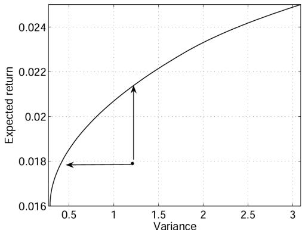
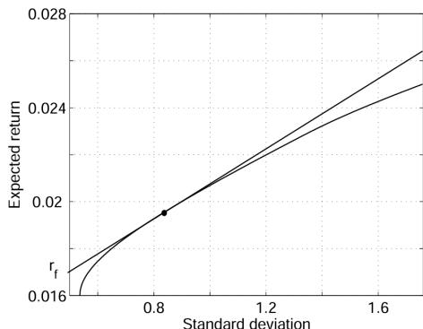

# Stochastic Finance and Risk Modelling

# 4 - Optimal portfolios

# Original slides from Romain Perchet

Laurence Carassus and Gaoyue Guo

CentraleSupélec

# Outline

Reward and risk

Market portfolio w 0 = 0

General portfolio

# Program

Reward and risk

Market portfolio w 0 = 0

General portfolio

# P vs Q : from seller to buyer

The market consists of 1 riskless asset $S _ { t } ^ { 0 }$ and $d$ risky assets$S _ { t } = ( S _ { t } ^ { 1 } , \ldots , S _ { t } ^ { d } )$ on some probability space $( \Omega , \mathcal { F } , \mathbb { P } )$ .

▶ We focus on the one-period model, i.e. $T = 1$ .

Sellers aim to build a “fair” pricing framework for trading financialproducts — arbitrage-free condition and risk-neutral $\mathbb { Q } \sim \mathbb { P }$ .

In what follows we stand for buyers, and our goal is to optimize“utility function” — maximise reward and minimize risk.

# Portfolio

▶ A portfolio, denoted by $V ^ { \xi ^ { 0 } , \xi }$ , is identified by the trading strategy(ξ 0 , ξ ) ∈ R × Rd , i.e.

$$
V _ {t} ^ {\xi^ {0}, \xi} := \xi^ {0} S _ {t} ^ {0} + \xi \cdot S _ {t}, \quad t = 0, 1.
$$

▶ Set

$$
w ^ {i} := \frac {\xi^ {i} S _ {0} ^ {i}}{V _ {0} ^ {\xi^ {0} , \xi}} = \frac {\xi^ {i} S _ {0} ^ {i}}{\sum_ {i = 0} ^ {d} \xi^ {i} S _ {0} ^ {i}} \quad \text {f o r} i = 0, \ldots , d.
$$

dClearly, X w i = 1. If $w ^ { i } > 0$ (resp. $w ^ { i } < 0 )$ ) means long (resp. short)i=0position of $S ^ { j }$ . If $w ^ { i } \geq 0$ , $w ^ { j }$ denotes the proportion of $V _ { 0 } ^ { \xi ^ { 0 } , \xi }$ investedin the i th asset.

$$
V _ {t} ^ {\xi^ {0}, \xi} = V _ {0} ^ {\xi^ {0}, \xi} \sum_ {i = 0} ^ {d} w ^ {i} \frac {S _ {t} ^ {i}}{S _ {0} ^ {i}}, \quad t = 0, 1.
$$

▶ $1 \mathsf { f } \ w : = ( w ^ { 1 } , \ldots , w ^ { d } ) : w ^ { 0 } + w \cdot { \bf 1 } = 1 ,$ $, w ^ { d } ) : w ^ { 0 } + w \cdot { \bf 1 } = 1 , \quad \mathrm { w i t h ~ } { \bf 1 } : = ( 1 , . \times$ . . , 1) ∈ R d .

# Reward and risk

▶ Recall that the return of V ξ0,ξ is defined if $V _ { 0 } ^ { \xi ^ { 0 } , \xi } \neq 0$ by

$$
\begin{array}{l} \rho (V ^ {\xi^ {0}, \xi}) := \frac {V _ {1} ^ {\xi^ {0} , \xi} - V _ {0} ^ {\xi^ {0} , \xi}}{V _ {0} ^ {\xi^ {0} , \xi}} = \frac {\xi^ {0} (S _ {1} ^ {0} - S _ {0} ^ {0}) + \xi \cdot (S _ {1} - S _ {0})}{V _ {0} ^ {\xi^ {0} , \xi}} \\ = \frac {\xi^ {0} S _ {0} ^ {0}}{V _ {0} ^ {\xi^ {0} , \xi}} \frac {S _ {1} ^ {0} - S _ {0} ^ {0}}{S _ {0} ^ {0}} + \sum_ {i = 1} ^ {d} \frac {\xi_ {i} S _ {0} ^ {i}}{V _ {0} ^ {\xi^ {0} , \xi}} \frac {S _ {1} ^ {i} - S _ {0} ^ {i}}{S _ {0} ^ {i}} \\ = w ^ {0} \rho (S ^ {0}) + \sum_ {i = 1} ^ {d} w ^ {i} \rho (S ^ {i}) =: w ^ {0} \rho (S ^ {0}) + w \cdot \rho (S). \\ \end{array}
$$

Recall that $\rho ( S ^ { 0 } ) = r$ where $S _ { t } ^ { 0 } = S _ { 0 } ^ { 0 } ( 1 + r ) ^ { t }$ and

$$
\rho (S) := (\rho (S ^ {1}), \dots , \rho (S ^ {d})).
$$

▶ As $w ^ { 0 } = 1 - w \cdot 1$ , from now we write $V ^ { w }$ instead of V ξ0,ξ.

# Reward and risk

▶ The expected return of the portfolio $V ^ { w }$ is given

$$
r (V ^ {w}) := \mathbb {E} ^ {\mathbb {P}} [ \rho (V ^ {w}) ] \equiv \mathbb {E} [ \rho (V ^ {w}) ] = (1 - w \cdot \mathbf {1}) R ^ {0} + w \cdot R
$$

where R i = E[ρ(S i )] = E  S i1S i  − 1 for i = 0, . . . , d .

We assume that $R = ( R _ { 1 } , \ldots , R _ { d } )$ is not colinear to 1.

The risk of the portfolio V w is given

$$
\begin{array}{l} V a r \left(\rho \left(V ^ {w}\right)\right) := \mathbb {E} \left[ \left(\rho \left(V ^ {w}\right) - \mathbb {E} \left[ \rho \left(V ^ {w}\right) \right]\right) ^ {2} \right] \\ = \sum_ {1 \leq i, j \leq d} w ^ {i} w ^ {j} \operatorname {C o v} \left(\rho \left(S _ {t} ^ {i}\right), \rho \left(S _ {t} ^ {j}\right)\right) = w ^ {T} \Sigma w, \\ \end{array}
$$

$\mathsf { w h e r e } \Sigma : = ( \sigma _ { i , j } ) _ { 1 \leq i , j \leq d }$ and

$$
\sigma_ {i, j} := C o v (\rho (S _ {t} ^ {i}), \rho (S _ {t} ^ {j})) = \frac {C o v (S _ {t} ^ {i} , S _ {t} ^ {j})}{S _ {0} ^ {i} S _ {0} ^ {j}}.
$$

We assume that Σ is invertible and positive def, i.e.

w ̸= 0 ⇒ wT Σw > 0.Laurence Carassus and Gaoyue Guo

# Objective

Let $\sigma > 0$ and $\mu \in \mathbb { R }$ .

▶ Maximize the reward $\mathbb { E } [ \rho ( V ^ { w } ) ]$ under the risk constraint :

$$
\max  _ {w \in E} \left(\left(1 - w \cdot \mathbf {1}\right) R ^ {0} + w \cdot R\right) \quad \text {s . t .} \quad w ^ {T} \Sigma w \leq \sigma^ {2}.
$$

▶ Minimize the variance $V a r ( \rho ( V ^ { w } ) )$ under a reward constraint :

$$
\min  _ {w \in E} w ^ {T} \Sigma w \quad \text {s . t .} \quad (1 - w \cdot \mathbf {1}) R ^ {0} + w \cdot R \geq \mu .
$$

▶ Optimize

$$
\max  _ {w \in E} \left(\left(1 - w \cdot \mathbf {1}\right) R ^ {0} + w \cdot R - \frac {\lambda}{2} w ^ {T} \Sigma w\right)
$$

The subset $E \subset \mathbb { R } ^ { d }$ stands for trading constraints for the risky assets and$\lambda \geq 0$ denotes the risk aversion parameter.

# Program

Reward and risk

Market portfolio w 0 = 0

General portfolio

# Market portfolio : w 0 = 0 or w · 1 = 1

We start by considering $w ^ { 0 } = 0$ and set $E = E _ { 0 } : = \{ w \in \mathbb { R } ^ { d } : w \cdot { \bf 1 } = 1 \} .$Then one obtains respectively

$$
f (\sigma) := \max  _ {w \in E _ {0}} w \cdot R \quad \text {s . t .} \quad w ^ {T} \Sigma w \leq \sigma^ {2} \tag {1}
$$

$$
g (\mu) := \min  _ {w \in E _ {0}} w ^ {T} \Sigma w \quad \text {s . t .} \quad w \cdot R \geq \mu \tag {2}
$$

$$
\max  _ {w \in E _ {0}} \left(w \cdot R - \frac {\lambda}{2} w ^ {T} \Sigma w\right). \tag {3}
$$

To illustrate, take $d = 3$ and

$$
R = \left( \begin{array}{c} 0. 0 1 8 \\ 0. 0 2 5 \\ 0. 0 1 \end{array} \right) \quad \text {a n d} \quad \Sigma = \left( \begin{array}{c c c} 1. 0 8 & 0. 3 4 & 0. 3 8 \\ 0. 3 4 & 3. 0 9 & - 1. 5 9 \\ 0. 3 8 & - 1. 5 9 & 1. 5 4 \end{array} \right).
$$

# Example

Solving (2) for $\mu = 0 . 0 1 8 ,$ ,

▶ one obtains the optimizer ˜w = (0.046, 0.509, 0.445) ;

▶ one has $\tilde { w } \cdot R = 0 . 0 1 8 = \mu$ and $g ( \mu ) = \tilde { w } ^ { T } \Sigma \tilde { w } = 0 . 4 2 2$

▶ Another feasible $w = ( 1 , 0 , 0 ) \in E _ { 0 }$ satisfying w · R = µ yields thevariance $\sigma _ { 1 , 1 } = w ^ { T } \Sigma w = 1 . 0 8 > g ( \mu )$ ;

▶ If comparing the two portfolios ˜w and $w$ , we notice that the varianceof the return of ˜w is about four times below $\sigma _ { 1 , 1 }$ . This means that ˜wis much more diversified.

Solving similarly (1) for $\sigma ^ { 2 } = \sigma _ { 1 , 1 }$

▶ one obtains the optimizer ˜w = (0.282, 0.69, 0.028) ;

▶ one has $\tilde { w } ^ { T } \Sigma \tilde { w } = \sigma ^ { 2 }$ and $\begin{array} { r } { f ( \sigma ) = \tilde { w } \cdot R = 0 . 0 2 2 6 } \end{array}$

▶ $w = ( 1 , 0 , 0 ) \in E _ { 0 }$ is still feasible as $w ^ { T } \Sigma w = \sigma ^ { 2 }$ , while thecorresponding expected return is $R _ { 1 } = 0 . 0 1 8 < f ( \sigma )$ .

# Mean-variance efficient frontier

We continue the analysis by describing the set of all optimal portfolios.

▶ The function $[ \underline { { R } } , \overline { { R } } ] \ni \mu \to g ( \mu ) \in \mathbb { R } _ { + }$ is well defined by solving thecorresponding minimization problems (2), where R := min Ri and1≤i≤dR := max Ri .1≤i ≤d

▶ We can determine the trade-off, known as the efficient frontier,between variance $\sigma$ and expected return $\mu$ . The efficient frontier canalso be obtained by solving (1). The difference is that we vary theupper bound on the variance and maximize the expected return.

▶ By varying the risk aversion parameter $\lambda$ and solving (3), we obtainthe mean-variance efficient portfolios.

If $\lambda = 0$ , then we obtain the portfolio with maximum expected return.

▶ If $\lambda \gg 1$ , then the relative importance of the variance in the objectivefunction becomes much greater.

# Lagrange method without the condition w · 1 = 1

To solve

$$
\min  _ {w \in \mathbb {R} ^ {d}} w ^ {T} \Sigma w \quad \text {s . t .} \quad \mathbf {w} \cdot R \geq \mu .
$$

We introduce the Lagrange multiplier

$$
L (w, \lambda) := w ^ {T} \Sigma w + \lambda (\mu - w \cdot R).
$$

It yields (first order conditions)

$$
\mathbf {0} = 2 \Sigma w - \lambda R \quad \text {a n d} \quad w \cdot R - \mu = 0
$$

and

$$
\tilde {w} = \mu \frac {\Sigma^ {- 1} R}{R ^ {T} \Sigma^ {- 1} R}.
$$

# Lagrange method

To solve

$$
\min  _ {w \in E _ {0}} w ^ {T} \Sigma w \quad \text {s . t .} \quad \mathbf {w} \cdot R \geq \mu ,
$$

recall that $E _ { 0 } : = \{ w \in \mathbb { R } ^ { d } : w \cdot \mathbf { 1 } = 1 \}$ . We introduce the Lagrangemultipliers

$$
L (w, \lambda , \theta) := w ^ {T} \Sigma w + \lambda (\mu - w \cdot R) + \theta (1 - w \cdot {\bf 1}).
$$

It yields

$$
\mathbf {0} = 2 \Sigma w - \lambda R - \theta \mathbf {1} \quad \text {a n d} \quad w \cdot R - \mu = 0 = w \cdot \mathbf {1} - 1
$$

and

$$
\tilde {\lambda} = 2 \frac {\mu c - b}{a c - b ^ {2}}, \quad \tilde {\theta} = 2 \frac {a - \mu b}{a c - b ^ {2}}, \quad \tilde {w} = \frac {1}{2} \tilde {\lambda} \Sigma^ {- 1} R + \frac {1}{2} \tilde {\theta} \Sigma^ {- 1} \mathbf {1},
$$

where

$$
a := R ^ {T} \Sigma^ {- 1} R, \quad b := R ^ {T} \Sigma^ {- 1} \mathbf {1}, \quad c := \mathbf {1} ^ {T} \Sigma^ {- 1} \mathbf {1}.
$$

# Efficient frontier

Recall that

$$
\tilde {\lambda} = 2 \frac {\mu c - b}{a c - b ^ {2}}, \quad \tilde {\theta} = 2 \frac {a - \mu b}{a c - b ^ {2}}, \quad \tilde {w} = \frac {1}{2} \tilde {\lambda} \Sigma^ {- 1} R + \frac {1}{2} \tilde {\theta} \Sigma^ {- 1} \mathbf {1},
$$

$$
\begin{array}{l} \tilde {w} = \frac {\mu c - b}{a c - b ^ {2}} \Sigma^ {- 1} R + \frac {a - \mu b}{a c - b ^ {2}} \Sigma^ {- 1} \mathbf {1} \\ = \mu \frac {c \Sigma^ {- 1} R - b \Sigma^ {- 1} \mathbf {1}}{a c - b ^ {2}} + \frac {a \Sigma^ {- 1} \mathbf {1} - b \Sigma^ {- 1} R}{a c - b ^ {2}} \\ = \mu h + g, \\ \end{array}
$$

where

$$
h = \frac {c \Sigma^ {- 1} R - b \Sigma^ {- 1} \mathbf {1}}{a c - b ^ {2}} \text {a n d} g = \frac {a \Sigma^ {- 1} \mathbf {1} - b \Sigma^ {- 1} R}{a c - b ^ {2}}.
$$

# Efficient frontier

Every portfolio of the efficient frontier can be written as $h \mu + g$

▶ g is the risky asset allocation corresponding to $\mu = 0$ , i.e. a zeroreturn.

$g + h$ is the risky asset allocation corresponding to $\mu = 1$

▶ Theorem of separation into two funds : in this model, it is enough toinvest in two funds instead than in the $d$ risky assets.

# Illustration

Take the previous example, we plot $\sigma \mapsto f ( \sigma )$ :

Figure – The curve is the efficient frontier. The dot indicates the position of asub-optimal portfolio and the arrows indicate the position of the optimalportfolios obtained by minimizing variance or maximizing expected return.

# Program

Reward and risk

Market portfolio w 0 = 0

General portfolio

# Riskless asset added

As a result, the minimization problem (2) becomes

$$
\min  _ {(w ^ {0}, w) \in \mathbb {R} \times E} w ^ {T} \Sigma w \quad \text {s . t .} \quad w ^ {0} R ^ {0} + w \cdot R \geq \mu \text {a n d} w ^ {0} + w \cdot \mathbf {1} = 1
$$

and the equivalent problems (1) and (3) change accordingly.

▶ The new set of mean-variance efficient portfolios is obtained byvarying the lower bound $\mu$ on the expected return ;

▶ The optimal portfolio is always a combination of one portfolio of therisky assets and the riskless asset ;

▶ Changing the lower bound $\mu$ results in different relative proportions ofthe two.

# An alternative point of view

▶ For each $w ^ { 0 } \in I : = ( - \infty , 1 )$ , one has ${ \hat { w } } \cdot \mathbf { 1 } = 1$ with$\hat { w } : = w / ( 1 - w ^ { 0 } )$ and $\hat { \mu } ( w ^ { 0 } ) : = ( \mu - w ^ { 0 } R ^ { 0 } ) / ( 1 - w ^ { 0 } )$

$$
\begin{array}{l} \min  _ {(w ^ {0}, \hat {w}) \in I \times E _ {0}} (1 - w ^ {0}) ^ {2} \hat {w} ^ {T} \Sigma \hat {w} \text {s . t .} \hat {w} \cdot R \geq \hat {\mu} (w ^ {0}) \\ \Rightarrow \min  _ {w ^ {0} \in I} (1 - w ^ {0}) ^ {2} g (\hat {\mu} (w ^ {0})). \\ \end{array}
$$

▶ All efficient portfolios can be represented as

$$
\rho (V) = \tilde {w} ^ {0} R ^ {0} + (1 - \tilde {w} ^ {0}) \tilde {w} \cdot \rho (S),
$$

where $( 1 - \tilde { w } ^ { 0 } ) \tilde { w }$ denotes the scaled weights of the market portfolioand $\tilde { w } ^ { 0 }$ is the weight of the riskless asset ;

▶ The market portfolio is located on the efficient frontier, where astraight line passing through the location of the riskless asset istangent to the efficient frontier. The straight line is knownasthecapital market line and the market portfolio is also known as thetangency portfolio.

# Illustration

Figure below shows the efficient frontier of the previous example but withstandard deviation instead of variance :

Figure – The dot indicates the position of the market portfolio, where the capitalmarket line is tangent to the efficient frontier.The interest rate $r$ is shown on thevertical axis and the straight line is the capital market line.

# Equation of the capital market line

Rewrite $V _ { M } : = \tilde { w } \cdot S$ . Then

$$
\rho (V) = \tilde {w} ^ {0} \rho (S ^ {0}) + (1 - \tilde {w} ^ {0}) \rho (V _ {M}).
$$

Taking the expectation on both sides,

$$
r (V) = \tilde {w} ^ {0} R ^ {0} + (1 - \tilde {w} ^ {0}) r (V _ {M}) = R ^ {0} + (1 - \tilde {w} ^ {0}) \big (r (V _ {M}) - R ^ {0} \big);
$$

Taking the variance on both sides,

$$
\operatorname {V a r} (\rho (V)) = \left(1 - \tilde {w} ^ {0}\right) ^ {2} \operatorname {V a r} (\rho (V _ {M}));
$$

We derive the capital market line equation

$$
r (V) = R ^ {0} + \sqrt {\frac {\operatorname {V a r} (\rho (V))}{\operatorname {V a r} (\rho (V _ {M}))}} \big (r (V _ {M}) - R ^ {0} \big),
$$

which describes the efficient frontier with the riskless asset added tothe investment universe.