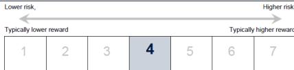
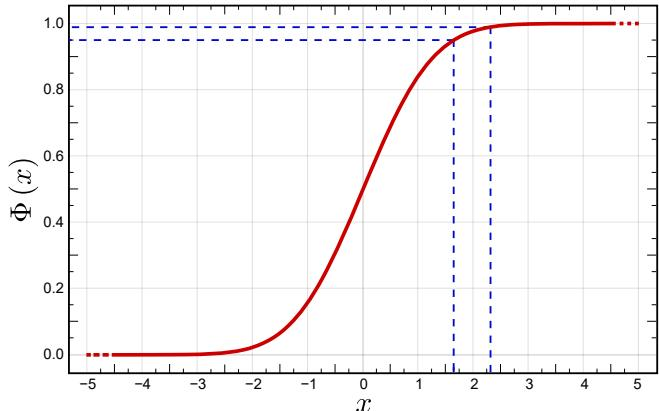
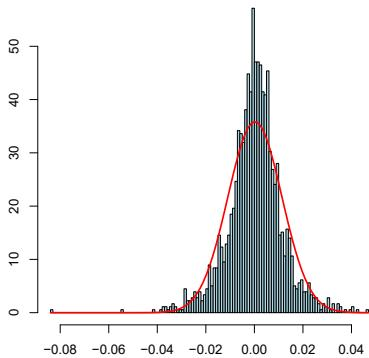
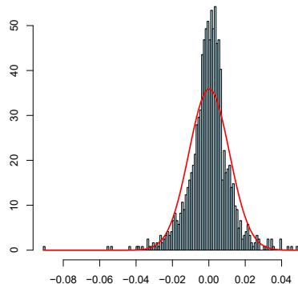
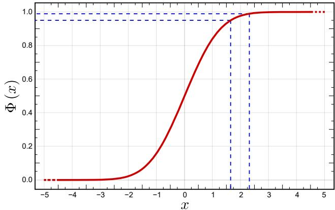
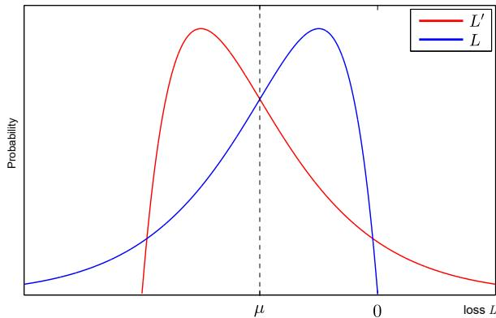
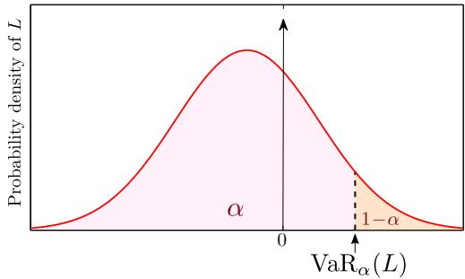
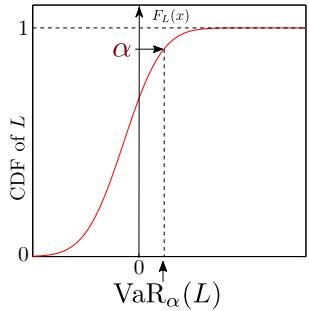

# Stochastic Finance and Risk Modelling

# 8 - Risk measures

# Original slides from Andrea Molent

Laurence Carassus and Gaoyue Guo

CentraleSupélec

# Outline

Introduction

Reminders on distribution functions and quantiles

Definitions and properties of risk measures

Variance

Value at risk (VaR)

Expected shortfall (ES)

Optimal management of risk

# Section 1

# Introduction

# Introduction

The losses suffered in the financial markets by many financialinstitutions and some industrial companies have drawn attentionto the need for all financial intermediaries and for regulatory andsupervisory authorities to fully understand the risks involved infinancial activities.

Risk needs to be measured, monitored and managed. Theseverity and quality of the internal control depends on the goodunderstanding of risks.

The 2007-2009 crisis dramatically demonstrated that thisunderstanding was often lacking. It also underlined theimperfections of traditional risk measures, unsuited to times ofcrisis.

# Some risks related to the activities of financial institutions

Here are the main types of risk in the financial context (see Jorion 2007):

Market risk: the risk of unfavorable variations in one or more prices,rates, exchange rates, indices, volatilities, correlations and other marketfactors. Ex: changes in equity prices reduce the value of an investmentportfolio

Liquidity risk: the risk that the institution is not able to meet itsobligations as a result of poor synchronization of its inflows andoutflows. Ex: banks do not have the cash that would be required if allcustomers were to withdraw their deposits all at once.

Credit risk: the risk that the debtor is unable to meet his obligations topay interest and repay principal. Ex: An insolvent bank does not returnfunds to a depositor.

Operational risk: linked to human error, fraud or a deficiency in theinstitution’s operating system. Ex: a typing error puts securities on saleat an incorrect price.

# Market Risk in detail

We focus on market risk, which arises from movements in financial marketprices. Specific market risks differ according to the type of underlying asset:

Currency risk: arises from exposure to movements in foreign exchangerates.

Interest rate risk: arises from the impact of fluctuating interest rates anddirectly affects any agent borrowing or investing funds.

Equity risk: affects anyone holding a portfolio of shares, whose valuerises and falls according to the individual share prices in the stockmarket.

. Other market risks: there are residual market risks which fall in thiscategory. Among these are volatility risk, which affects option traders,and basis risk, which has a wider impact. Basis risk arises wheneverone kind of risk exposure is hedged with an instrument that behaves in asimilar, but not necessarily identical manner.

# Market Risk in detail

Market risk can take two forms:

Absolute risk: measured in dollar terms (or in the relevant currency);

Relative risk: measured relative to a benchmark index.

While the former focuses on the probability distribution of total returns, thelatter measures risk in terms of tracking error, or deviation from the index.

Market risk is controlled by limits on notionals, exposures, VAR measures,and independent supervision by risk managers. Market risk is the mainsubject of this course.

# Usefulness of risk measures

It is clear that a careful assessment of all the risks induced by the useof financial instruments is necessary to:

optimal allocation of own funds (regulatory capital), which is ascarce and expensive resource;

. effective control and monitoring of risks (in particular thoserelating to traders’ positions, illiquid assets, complex derivativeproducts with high leverage, etc.) and their management, inparticular through hedging operations (traffic lights system);

satisfy compliance (conformity) with obligations andrecommendations from supervisory and/or steering committees.

# Two levels of regulation

At the national level, the banking authorities, the financial marketregulators, as well as the clearing houses of the various organizedmarkets, generally impose obligations aimed at improving thecontrol of financial activities.

. At the international level the Basel Committee, in its “ CapitalAdequacy Directive” doc. (1995), recommended the use of aforfaitaire method for measuring market risk calculated withinternal models. Such an approach is based on the concept ofValue at Risk (VaR).

The so-called Basel II agreements (2004) have clarified andreinforced this directive. Recently, an important reflection wasinitiated to correct the deficiencies of the systems observed duringthe crisis of 2007-2009.

# The VaR (Value at Risk)

Risk measure introduced by JP Morgan in the early 1990s.

Summarizes the risks affecting a portfolio or an asset-liability positioninto a single explainable value.

. Given a confidence interval, it tries to quantify the potential loss that onemay suffer over a short period of time under so-called normal marketconditions.

In terms of ideas, this notion derives from the concept of “probability ofruin” formerly used by insurance companies.

Conceptually very simple concept (quantile of the distribution of losses);its calculation can be complex when it concerns a position comprisingdifferent instruments, including derivatives.

. Marred by a number of flaws, other indicators such as the ExpectedShortfall (ES) and risk measurement instruments have been developedto overcome these shortcomings.

# Key Investor Information Document for customers

# Riskand Reward Profile

The risk level of this Sub-Fund mainly reflects the market risk arising frominvestments in high yield bonds.

Historical data may not be a reliable indication for the future

Risk category shown is not guaranteed and may shift over time.

The lowest category does not mean 'risk free

Your initial investment does not benefit from any guarantee or protection

For un-hedged currency classes, exchange rate movements may affect therisk indicator where the currency of the underlying investments differs from thecurrency of the share class.

 Important risks materially relevant to the Sub-Fund which are not adequatelcaptured by the indicator:

Credit risk:represents the risks associated with an issuer'ssudden downgrading of its signature's quality or its default

Liquidity risk: in case of low trading volume on financial markets,any buy or selltrade on these markets may lead to importantmarket variations/fluctuations that may impact your portfoliovaluation.

Counterparty risk:represents the risk of default of a marketparticipant tofulfilits contractual obligations vis-a-vis yourportfolio.

Operational risk: this is the risk of default or error within thedifferent service providers involved in managing and valuing yourportfolio.

Emerging Markets risk : Some of the countries invested in maycarry higher political, legal，economic and liquidity risks thaninvestments in more developed countries

The occurrence of any of these risks may have an impact on the netasset value of your portfolio

Figure: “Key Investor Information Document” (KIID) of funds reports informationabout risk intended for customers. The synthetic indicator classifies the Fund on ascale of 1 to 7 based on the annual historical volatility of the same over a period of 5years. The scale, in ascending order from left to right, represents the levels risk andpotential reward from lowest to highest.

# Section 2

# Reminders on distribution functions andquantiles

# Definition

Let X be a (real) random variable. We term the cumulative distributionfunction (CDF) of X the function $F _ { X } : \mathbb { R } \to [ 0 , 1 ]$ defined by

$$
\forall x \in \mathbb {R}, F _ {X} (x) = \mathbb {P} (X \leq x).
$$

# Proposition

The CDF FX of a random variable $X$ is

weakly increasing

bounded and right-continuous (càdlàg)

$$
\forall x _ {0} \in \mathbb {R}, \lim  _ {x \to x _ {0} ^ {+}} F _ {X} (x) = F _ {X} (x _ {0})
$$

it verifies the following limits;

$$
\lim  _ {x \to - \infty} F _ {X} (x) = 0, \quad \lim  _ {x \to + \infty} F _ {X} (x) = 1,
$$

# Example

Figure: The CDF $\Phi ( x )$ of a standard normal random variable. Two interestingvalues: $\Phi ( 1 . 6 4 ) \approx 0 . 9 5$ and $\Phi ( 2 . 3 3 ) \approx 0 . 9 9$ .

# Properties

The CDF has the following properties

It characterizes the law of the r.v: if $X$ and $Y$ are two random variableshaving the same CDF, so

$$
\forall f: \mathbb {R} \rightarrow \mathbb {R} \text {b o u n d e d m e a s u r a b l e f u n c t i o n ,} \mathbb {E} [ f (X) ] = \mathbb {E} [ f (Y) ].
$$

A sequence of r.v.s $( X _ { n } ) _ { n \geq 1 }$ converges in law (weak convergence) if and only if, for every continuity point $x \in \mathbb { R }$ of the function $F _ { X }$ , the followinglimit holds

$$
\lim  _ {n \rightarrow + \infty} F _ {X _ {n}} (x) = F _ {X} (x).
$$

. If the sequence of r.v.s $\left( X _ { n } \right) _ { n \geq 1 }$ is i.i.d (independent and identically distributed), then the Glivenko-Cantelli Theorem assures that theconvergence of the empirical distribution function to the CDF is uniformin $x$ .

# Quantiles and generalized inverse

# Definition

Let X be a r.v. and let FX be its CDF. For any $p \in ] 0 , 1 ]$ we termthe quantile of order $| | \boldsymbol { p } | |$ of $X$ (or p-th quantile) the number

$$
x _ {p} = \inf  \left\{x \in \mathbb {R}: F _ {X} (x) \geq p \right\}
$$

with, as a convention, inf $\{ \emptyset \} = + \infty$ .

The function

$$
F _ {X} ^ {- 1}: ] 0, 1 [ \rightarrow \mathbb {R}
$$

$$
p \mapsto x _ {p}
$$

is right continuous and it is called the generalized inverse of FX.

# Example

$$
\Phi^ {- 1} (0. 9 5) \approx 1. 6 4 a n d \Phi^ {- 1} (0. 9 9) \approx 2. 3 3, t h a t i s x _ {0. 9 5} \approx 1. 6 4 a n d x _ {0. 9 9} \approx 2. 3 3.
$$

# Proposition

Let FX be a CDF and let $F _ { X } ^ { - 1 }$ be its generalized inverse. So, for anyp 2 ]0, 1[,

$$
F _ {X} \left(F _ {X} ^ {- 1} (p)\right) \geq p
$$

holds. Moreover

$$
F _ {X} (x) \geq p \Leftrightarrow x \geq F _ {X} ^ {- 1} (p)
$$

Proof: exercise.

# Remarks

If $F _ { X }$ is continuous, then $\forall p \in ] 0 , 1 [ , F _ { X } \left( F _ { X } ^ { - 1 } \left( p \right) \right) = p$

Let $X$ and $U$ be r.v.s, $U$ following a uniform distribution in [0, 1]. Then,the r.v. $F _ { X } ^ { - 1 } \left( U \right)$ has the same law of $X$ .

If $F _ { X }$ is continuous, then $F _ { X } \left( X \right)$ follow a uniform distribution in [0, 1].

If $F _ { X }$ is invertible from $\mathbb { R }$ to $] 0 , 1 [$ [, then it is continue on $\mathbb { R }$ and equality$F _ { X } \left( F _ { X } ^ { - 1 } \left( p \right) \right) = p$ implies that $F _ { X } ^ { - 1 }$ is exactly the inverse of $F _ { X }$ .

It is useful to consider the generalized inverse because such a functionis well-defined even if $F _ { X }$ is not invertible. This may happen because$F _ { X }$ is not continuous or because it is constant on non-empty intervals.

# Section 3

# Definitions and properties of risk measures

# Framework and Notations

We aim to measure the risk affecting the market value of a (long) givenposition. Let $( \Omega , { \mathcal { F } } )$ be a measurable space. We note

$V _ { 0 }$ the current value (time $t = 0$ ) of the position or portfolio inquestion;

$V _ { h }$ the value of this portfolio at horizon $h$ (for example $h = 1 0$ days,after 10 days have passed)

$L : = V _ { 0 } - V _ { h }$ the loss between $t = 0$ and $t = h$ ; that’s ameasurable r.v. which may be positive (loss) or negative (gain).he risk of loss is assessed by using the probability distribution of $L$rom which different indicators can be calculated. Let’s term

$$
F _ {L} = \mathbb {P} \left(L \leq x\right), x \in \mathbb {R}
$$

A measure of risk allows one to express the riskiness of a position withjust one number. Obviously, the riskier a position is, the higher itsmeasure of risk will be. Three cases:

$\rho \left( L \right) > 0 : \rho \left( L \right)$ represents the amount of capital an agent has toadd to the risky position to make it an acceptable position.

$\rho \left( L \right) = 0$ : the position is acceptable (satisfies capitalrequirements).

$\rho \left( L \right) < 0 : - \rho \left( L \right)$ represents the cash amount that can be pulledout from the already being acceptable position (and invest it in amore profitable way).

As far as a position is considered, $\rho \left( L \right)$ can be interpreted as theamount of required own funds associated with this position.

# First examples

We denote by $L ^ { \infty }$ the set of positions $L$ such that

$$
\| L \| _ {\infty} = \sup  _ {\omega \in \Omega} | L (\omega) | <   + \infty
$$

Let $\rho$ be a function defined on $A \subset L ^ { \infty }$ with values in R.

Several choices for risk measures are possible:

$\begin{array} { r } { \pmb { \Theta } \rho _ { \mathrm { m a x } } \left( \boldsymbol { L } \right) = \operatorname* { s u p } _ { \omega \in \Omega } \boldsymbol { L } \left( \omega \right) } \end{array}$ (generally bad idea, too conservative).

$\rho \left( L \right) = \mathbb { E } _ { \mathbb { P } } \left[ L \right]$ mean loss. More generally $\begin{array} { r } { \rho \left( L \right) = \operatorname* { s u p } _ { \mathbb { P } \in \mathcal { P } } \mathbb { E } _ { \mathbb { P } } \left[ L \right] } \end{array}$ with$\mathcal { P } \subset \mathcal { M } _ { 1 } = \{ \mathbb { P }$ probability over $( \Omega , { \mathcal { F } } ) \}$

Quadratic risk: E $\left[ L ^ { 2 } \right]$ .

Variance: $V a r \left[ L \right] = \mathbb { E } \left[ L ^ { 2 } \right] - \mathbb { E } ^ { 2 } \left[ L \right]$

Semi-variance: considering only unfavorable cases, that is the events forwhich $L$ is positive. Specifically: E $\left[ L _ { + } ^ { 2 } \right] - \mathbb { E } ^ { 2 } \left[ L _ { + } \right]$ with $L _ { + } = \operatorname* { m a x } { \{ L , 0 \} }$ 

# VaR

An important risk measure:

Value at Risk (VaR): the $\operatorname { V a R } _ { \alpha } \left( L \right)$ is the quantile of level $\alpha$ of thelaw of $L$ for a probability $\mathbb { P }$ defined over $( \Omega , { \mathcal { F } } )$ . Specifically

$$
\mathrm {V a R} _ {\alpha} (L) = F _ {L} ^ {- 1} (\alpha)
$$

Why do all these function define risk measures? What do they have incommon?

# Monetary Risk Measure

# Definition

We say that $\rho$ is a monetary risk measure if the following properties hold:

1 monotony: $\rho$ is an increasing func. that is if $L _ { 1 } \leq L _ { 2 }$ then $\rho \left( L _ { 1 } \right) \leq \rho \left( L _ { 2 } \right)$

2 cash invariance: $\rho$ is “invariant by translation” that is

$$
\forall m \in \mathbb {R}, \rho (L + m) = \rho (L) + m.
$$

Thanks to cash invariance property, $\rho \left( L \right)$ is the amount to subtract from loss(increase the gain) in order to make the position acceptable:

$$
\rho (L - \rho (L)) = \rho (L) - \rho (L) = 0.
$$

# Normalization

Unless we set $\tilde { \rho } \left( x \right) = \rho \left( x \right) - \rho \left( 0 \right)$ , one can suppose $\rho \left( 0 \right) = 0$ .

Normalization implies that if $k \in \mathbb { R }$ then $\rho \left( k \right) = \rho \left( 0 + k \right) = \rho \left( 0 \right) + k = k .$

# Proposition

Every monetary risk measure is Lipschitz:

$$
\left| \rho (L _ {2}) - \rho (L _ {1}) \right| \leq \left\| L _ {2} - L _ {1} \right\| _ {\infty}
$$

# Proof

Simple alge

By monoton  L1k

Then $\rho \left( L _ { 2 } \right) - \rho \left( L _ { 1 } \right) \leq \left\| L _ { 2 } - L _ { 1 } \right\| _ { \infty }$

Similarly, ⇢ (

Thus

$$
- \left\| L _ {2} - L _ {1} \right\| _ {\infty} \leq \rho (L _ {2}) - \rho (L _ {1}) \leq \left\| L _ {2} - L _ {1} \right\| _ {\infty}.
$$

# Convexity

# Definition

A function ⇢ is said to be convex if

$$
\rho (\theta L _ {1} + (1 - \theta) L _ {2}) \leq \theta \rho (L _ {1}) + (1 - \theta) \rho (L _ {2}), \forall \theta \in [ 0, 1 ]
$$

Diversification reduces risk!

# Definition

We say that ⇢ is a convex risk measure if $\rho$ is a monetary risk measureand it is convex.

# Homogeneity and Coherence

# Definition

We say that ⇢ is positively-homogeneous if

$$
\rho (\lambda L) = \lambda \rho (L), \forall \lambda \geq 0
$$

In general, for liquidity problems in particular, when we have a verylarge position (large quantity of shares), we then have

$$
\rho (\lambda L) \geq \lambda \rho (L), \forall \lambda \geq 1
$$

Such a phenomenon is known as concentration risk.

# Definition

We say that $\rho$ is a coherent risk measure if $\rho$ is a positivelyhomogeneous, convex, monetary risk measure.

# Summmary

# Properties

A coherent risk measure is:

1 increasing;

2 invariant by translation;

3 positively homogeneous;

4 convex.

# Proposition

Let ⇢ be a positive-homogeneous risk measure.

$\rho$ is convex if and only if it is sub-additive ie

$$
\rho \left(L _ {1} + L _ {2}\right) \leq \rho \left(L _ {1}\right) + \rho \left(L _ {2}\right)
$$

# Proof

sub-additivity $\Rightarrow$ convexity: clear;

convexity $\Rightarrow$ sub-additivity: exercise. Prompt: set $\begin{array} { r } { \theta = \frac { 1 } { 2 } } \end{array}$

# Examples

$\rho _ { \mathrm { m a x } } \left( L \right)$ is coherent. It is the most conservative coherentmeasure: if $\eta$ is a coherent m. then $\eta \left( L \right) \leq \rho _ { \operatorname* { m a x } { } } \left( L \right)$ ;

2 $\rho \left( L \right) = \operatorname* { s u p } _ { \mathbb { P } \in { \mathcal { P } } } \mathbb { E } _ { \mathbb { P } } \left[ L \right]$ with $\mathcal { P } \subset \mathcal { M } _ { 1 }$ is coherent.

3 Quadratic risk is not a coherent risk measure;

Variance is not a coherent risk measure; neither the standarddeviation;

$\operatorname { V a R } _ { \alpha }$ is increasing, invariant by translation, positivelyhomogeneous but not convex in general.

# Section 4

# The variance (or the standard deviation)

First synthetic indicator of the risk of a portfolio (Markowitz, 1952):Investors should be interested in the overall risk of their portfolioand take into account diversification.

This theory relies on the standard deviation of portfolio value as ameasure of risk, in accordance with the mean-variance paradigm$\sigma _ { L } = { \sqrt { V a r \left( L \right) } } .$ .

Main disadvantage: deviations of the loss from its average bynegative values (gains) are taken into account in the same way aspositive deviations (losses).

# Drawback of variance

Figure: Two loss probability distributions, with the same standard deviation.

# Drawback of variance

. In general, the standard deviation L is difficult to interpretbecause, in the absence of info on the shape of the distribution of$L$ , it is not unambiguously related to the probabilities of loss. In theprevious figure, for example, two different distributions of $L$ , withthe same standard deviation and mean, correspond to differentrisks of loss (there is no risk of loss in the case of the blue curve).

The two distributions of $L$ and $L ^ { \prime }$ have the same mean $\mu$ andstandard deviation $\sigma$ (they are symmetrical to each other aboutthe axis vertical from the common mean $\mu < 0 \mathrm { \AA }$ ) but the distributionof $L$ excludes any risk of loss $( \mathbb { P } \left( L > 0 \right) = 0 )$ ) unlike that of $L ^ { \prime }$ . It istherefore misleading to estimate equal the risks induced byholding the same actives.

# Example

# Example

Let us suppose the loss $L$ to follow a normal distribution withmean 1 M e (expectated gain of +1 M e) and std. dev. 3 M e. IfN denotes a standard Gaussian variable, then $L$ has the samelaw of 3N 1, therefore

$$
\mathbb {P} (L > 2) = \mathbb {P} (N > 1) = 1 - \Phi (1) \approx 0. 1 5 8 7
$$

a probability of 15.87% for the loss to be greater than or equal to2 $M \in ,$ , but this answer relies crucially on the assumption ofnormality, which is generally unverified.

E Suppose now that the distribution of the gain $G = - L$ islog-normal: there is a zero probability for the loss to be greaterthan 0 $M \in ,$ , whatever (since lognormal distribution is assumed,the loss $L$ is always less than 0 M e).

# Section 5

# The Value at Risk (VaR)

# Definition and interpretations

# Definition

The VaR at horizon $h$ and at the probability threshold $\alpha$ is the$\alpha$ -quantile of the loss L:

$$
\operatorname {V a R} _ {\alpha} (L) = F _ {L} ^ {- 1} (\alpha), \text {w i t h} F _ {L} (x) = \mathbb {P} (L \leq x)
$$

The loss for the period of duration $h$ to come will be less than the VaRwith a probability $\alpha$ (usually $\alpha = 9 5 \%$ or 99%); thus, the VaR can beinterpreted as a maximum loss at a given confidence level.

# Remark

For the sake of simplicity and because the relevant horizon forcalculating VaR is generally very short, we will never take thediscount factor into account even though we are reasoning on afuture value of the portfolio or position concerned.

Note, further, that in the case of a discrete probability distribution,$\alpha \%$ of observations do not generally give an integer; it willtherefore be necessary to decide to round up (pessimistic view) orlower (optimistic view) this observation threshold.

# Graphic interpretation

Left: probability density of loss $L$ and VaR.

Right: cumulative distribution function of the loss $L$ and VaR.

# Properties

The VaR is increasing: if $L _ { 1 } \leq L _ { 2 }$ , then for all $x \in \mathbb { R }$

$$
F _ {1} (x) = \mathbb {P} \left(L _ {1} \leq x\right) \geq \mathbb {P} \left(L _ {2} \leq x\right) = F _ {2} (x). \text {S o f e v e r y} x \in \mathbb {R}
$$

$$
F _ {1} ^ {- 1} (x) \leq F _ {2} ^ {- 1} (x) \text {a n d s o} \operatorname {V a R} _ {\alpha} \left(L _ {1}\right) \leq \operatorname {V a R} _ {\alpha} \left(L _ {2}\right)
$$

. The VaR is invariant by translation: let $m \in \mathbb { R }$ . Then

$$
\begin{array}{l} \operatorname {V a R} _ {\alpha} (L + m) = \inf  \{x \in \mathbb {R}: \mathbb {P} (L + m \leq x) \geq \alpha \} \\ = \inf  \left\{x - m \in \mathbb {R}: \mathbb {P} (L \leq x - m) \geq \alpha \right\} + m \\ = \operatorname {V a R} _ {\alpha} (L) + m \\ \end{array}
$$

. The VaR is positively homogeneous: let $\lambda > 0$

$$
\begin{array}{l} \operatorname {V a R} _ {\alpha} (\lambda L) = \inf  \left\{x \in \mathbb {R}: \mathbb {P} (\lambda L \leq x) \geq \alpha \right\} \\ = \lambda \inf  \left\{x / \lambda \in \mathbb {R}: \mathbb {P} (L \leq x / \lambda) \geq \alpha \right\} \\ = \lambda \mathrm {V a R} _ {\alpha} (L) \\ \end{array}
$$

$$
\text {I f} \lambda = 0, \text {t h e n} \operatorname {V a R} _ {\alpha} (\lambda L) = \lambda \operatorname {V a R} _ {\alpha} (L) = 0.
$$

# VaR is not generally convex (so not sub-additive in general)

Counter-example. Let $X$ and Y be two independent r.v.s with Bernoulli’s lawof parameter $p \in [ 0 , 1 [$ [. So

$$
\operatorname {V a R} _ {\alpha} (X) = \operatorname {V a R} _ {\alpha} (Y) = \left\{ \begin{array}{l l} 0 & \text {i f} \quad \alpha \leq 1 - p \\ 1 & \text {i f} \quad \alpha > 1 - p \end{array} \right.
$$

Now, we have:

$$
\frac {X + Y}{2} = \left\{ \begin{array}{c c c} 0 & \text {w i t h p r o b .} & (1 - p) ^ {2} \\ 1 / 2 & \text {w i t h p r o b .} & 2 p (1 - p) \\ 1 & \text {w i t h p r o b .} & p ^ {2} \end{array} \right.
$$

$$
\mathrm {V a R} _ {\alpha} \left(\frac {X + Y}{2}\right) = \left\{ \begin{array}{c l} 0 & \mathrm {i f} \alpha \in ] 0, (1 - p) ^ {2} ] \\ 1 / 2 & \mathrm {i f} \alpha \in ] (1 - p) ^ {2}, 1 - p ^ {2} ] \\ 1 & \mathrm {i f} \alpha \in ] 1 - p ^ {2}, 1 ] \end{array} \right.
$$

Therefore, if $( 1 - p ) ^ { 2 } < \alpha < 1 - p < 1 - p ^ { 2 }$ then

$$
\frac {1}{2} = \mathrm {V a R} _ {\alpha} \left(\frac {X + Y}{2}\right) > \frac {1}{2} \left(\mathrm {V a R} _ {\alpha} (X) + \mathrm {V a R} _ {\alpha} (Y)\right) = 0
$$

# Alternative expressions of VaR

VaR is often expressed from the value $V _ { h }$ of the portfolio or the changein value of the latter, that is the gain $G = V _ { h } - V _ { 0 } = - L$ , rather than theloss L. By denoting $F _ { G }$ the CDF of the gain $G$ , we have

$$
\mathbb {P} \left(G \leq \operatorname {V a R} _ {\alpha} (L)\right) = 1 - \alpha \quad \text {a n d} \quad \operatorname {V a R} _ {\alpha} (L) = F _ {G} ^ {- 1} (1 - \alpha)
$$

Therefore, $\operatorname { V a R } _ { \alpha }$ is the $( 1 - \alpha )$ -quantile of the gain.

# Alternative expressions of VaR

We can also express VaR as a function of a quantile of return denotedby $q ^ { R }$ :

If R represents the linear-return, that is R = VhV0 = $R$ $\begin{array} { r } { R = { \frac { V _ { h } - V _ { 0 } } { V _ { 0 } } } = - \frac { L } { V _ { 0 } } } \end{array}$ , then$L = - V _ { 0 } R$ ; therefore

$$
\begin{array}{l} \mathbb {P} (L \leq \operatorname {V a R} _ {\alpha} (L)) = \alpha \Leftrightarrow \mathbb {P} (R \geq - \operatorname {V a R} _ {\alpha} (L) / V _ {0}) = \alpha \\ \Leftrightarrow - \mathrm {V a R} _ {\alpha} (L) / V _ {0} = q _ {1 - \alpha} ^ {R} \\ \Leftrightarrow \operatorname {V a R} _ {\alpha} (L) = - V _ {0} \cdot q _ {1 - \alpha} ^ {R} \\ \end{array}
$$

In a similar way, if $R ^ { \prime }$ denotes the log-return, that is $V _ { h } = V _ { 0 } \cdot e ^ { R ^ { \prime } }$ ,we obtain $L = { \dot { V } } _ { 0 } - V _ { h } = V _ { 0 } \cdot \left( 1 - e ^ { { \dot { R } } ^ { \prime } } \right)$ and we get (exercise)

$$
\mathrm {V a R} _ {\alpha} (L) = V _ {0} \left(1 - q _ {1 - \alpha} ^ {R ^ {\prime}}\right)
$$

# Gaussian case (I)

Let us suppose that the loss $L$ is normally distributed and itsparameters are known. In particular, $L = V _ { 0 } - V _ { h }$ is n.d. iff $V _ { h }$ is n.d., iffthe return is n.d..

Now, let $L \sim \mathcal { N } \left( \mu , \sigma ^ { 2 } \right)$ . Then,

$$
\operatorname {V a R} _ {\alpha} (L) = \mu + \sigma \cdot z _ {\alpha}
$$

with $z _ { \alpha }$ the $\alpha$ -quantile of the law $\mathcal { N } ( 0 , 1 )$

Sometimes VaR is calculated from the distribution of linear-return.Since $R = - L / V _ { 0 }$ , then $R \sim \mathcal N \left( \mu ^ { \prime } , \sigma ^ { \prime 2 } \right)$ with $\mu ^ { \prime } = - \mu / V _ { 0 }$ and$\sigma ^ { \prime } = \sigma / V _ { 0 }$ . We obtain

$$
\operatorname {V a R} _ {\alpha} (L) = V _ {0} \left(- \mu^ {\prime} + \sigma^ {\prime} \cdot z _ {\alpha}\right)
$$

# Gaussian case (II)

This relationship is equivalent to the previous one but expresses theVaR as a function of the parameters of the distribution of the linearreturn R of the portfolio rather than that of the loss L. According tointuition, the VaR is thus higher the greater the standard deviation of $R$and the lower the expectation of R.

As due to the symmetry of the normal distribution, we have

$z _ { \alpha } = - z _ { 1 - \alpha }$ , hence we can write

$$
\operatorname {V a R} _ {\alpha} (L) = - V _ {0} \left(\mu^ {\prime} + \sigma^ {\prime} \cdot z _ {1 - \alpha}\right)
$$

The preceding relationships are very commonly used to calculate aVaR in a simple way, but they can lead to large errors when thedistributions deviate from normality.

# Log-normal case

The assumption of lognormality of values is generally preferable to that ofnormality and has become standard in financial modeling. We thereforeassume that $V _ { h }$ is log-normal which implies that the log-return$R = \ln \left( V _ { h } \right) - \ln \left( V _ { 0 } \right)$ is normal. We can write

$$
V _ {h} = V _ {0} e ^ {R}, \quad L = V _ {0} - V _ {h} = V _ {0} \left(1 - e ^ {R}\right)
$$

The loss is therefore written as a decreasing function of the variableGaussian R. So,

$$
\operatorname {V a R} _ {\alpha} (L) = V _ {0} \left(1 - \exp \left(\mu^ {\prime} + \sigma^ {\prime} z _ {1 - \alpha}\right)\right) = V _ {0} \left(1 - \exp \left(\mu^ {\prime} - \sigma^ {\prime} z _ {\alpha}\right)\right)
$$

For low values of $h$ , consistent with the short horizons over which VaR isusually calculated, a 1-order expansion of the exponential in the previousrelation leads to those of the normal distribution. These normal-distributionrelationships are therefore usually good approximations of VaR when thevalue of the portfolio can be reasonably assumed to be log-normal.

# Distribution of returns

Histogram of daily returns of CAC40

Histogram of daily returns of Euro Stoxx 50

Figure: Distribution of the returns of the indices with the density of thenormal distribution of the same expectation and variance.

# Disadvantages of VaR: Technical issues

The distributions of short-term rates of return are generally not normalbut leptokurtic (extreme events more frequent than for the normaldistribution)). Problems arise with analytical methods which most oftenassume the normality of log-returns.

Returns are believed not to exhibit serial autocorrelation, which is ofteninaccurate.

Financial instruments are assumed to be liquid and valued under normalmarket conditions, which is quite contradictory to the very idea of VaR.

When the portfolio includes several asset classes, the aggregationproblem is not simple: if the VaR measures for the different classes aresimply added together, which implies perfect correlations betweenclasses, diversification is not taken into account. Therefore the risk isoverestimated and the resulting overhedging consumes too much equity,which is expensive.

# Technical issues

If correlations are taken into account, then undercoverage is the dangersource since correlations, which are generally unstable, may beunderestimated (mainly in times of crisis where the correlationsincrease, which limits the effect of diversification).

The VaR is not enough to calculate the adequate amount of own equity.

All these problems turned out to be very serious during the 2007-2009crisis: extreme events, serial auto-correlation, jumps, increasedcorrelation of different instruments greatly reducing the effects ofdiversification, etc.

The opportunism of the strategies and the massive use of optionalinstruments reinforce in particular the leptokurtosis, the asymmetry andthe non-stationarity of the distributions of profitability (in particular of thevolatility) of the portfolios thus managed.

# Conceptual difficulties

A single value (VaR) chosen on the distribution function cannot replacethe knowledge of the complete distribution of the value of the portfolio(probability of occurrence of a loss in excess of the calculated VaR, butdoes not say anything about the effective size loss).

VaR is calculated under the assumption of an unchanged portfolioduring the holding period.

The Basel Committee’s recommendation to adopt a holding period of 10working days for the calculation of the VaR is surprising since the lattermust be recalculated every day (volatilities and correlations change overtime, the size and composition of the portfolio change).

VaR is generally not subadditive (unless the loss distribution isGaussian, which is rarely the case in practice).

# Section 6

# Improving the VaR: the Expected Shortfall(ES)

If the VaR only considers the probability of a loss larger than thethreshold, it does not say anything about the size of the loss whenit occurs, nor, moreover, in general about the distribution of lossesover the period (except when a theoretical distribution, like theGaussian, is assumed a priori).

This is particularly troublesome for portfolio return distributionscharacterized by thick tails (leptokurtosis).

This is the reason why it is preferable to use (at least in acomplementary way) a risk measure called Expected Shortfall,denoted by ES, or also called Conditional VaR (CVaR) , whichtakes into account the profile of losses beyond the VaR.

# Definition

More formally, we calculate the conditional expectation of the loss,knowing that it is greater (or equal) to the VaR. By definition we obtain:

$$
\begin{array}{l} E S _ {\alpha} (L) = \mathbb {E} [ L \mid L \geq \operatorname {V a R} _ {\alpha} (L) ] \\ = \int_ {\mathrm {V a R} _ {\alpha} (L)} ^ {+ \infty} \frac {x f _ {L} (x)}{\mathbb {P} (L \geq \mathrm {V a R} _ {\alpha} (L))} d x \\ \end{array}
$$

where $f _ { L }$ is the density of the loss L. In the continuous case, weobtain

$$
E S _ {\alpha} (L) = \frac {1}{1 - \alpha} \int_ {\mathrm {V a R} _ {\alpha} (L)} ^ {+ \infty} x f _ {L} (x) d x
$$

So, the ES gives the average size of the loss above the VaR.

# Properties

By making the substitution $x = \mathrm { V a R } _ { u } \left( L \right)$ (well defined since VaR isincreasing and can be assumed differentiable), one obtains:

$$
E S _ {\alpha} (L) = \frac {1}{1 - \alpha} \int_ {\mathrm {V a R} _ {\alpha} (L)} ^ {+ \infty} x f _ {L} (x) d x = \frac {1}{1 - \alpha} \int_ {\alpha} ^ {1} \mathrm {V a R} _ {u} (L) d u
$$

This last expression constitutes an alternative definition of ES andexpresses the latter as an average of the VaRs calculated onthresholds u more binding than $\alpha$ .

# Properties

The decisive advantage of $E S$ is that, unlike VaR, this measure makesit possible to distinguish two distributions of loss which have the same$\alpha$ -quantile but are otherwise different (in particular do not have thesame distribution tails, or the same asymmetry). A second importantadvantage of ES is that it is a subadditive measure of risk.

# Proposition

Let $\alpha \in ( 0 , 1 )$ , then $\mathrm { E S } _ { \alpha }$ is a coherent risk measure.

# Analytical expression of ES in the Gaussian case

Let us suppose $L$ to follow a Gaussian distribution, that is$L \sim \mathcal { N } \left( \mu , \sigma ^ { 2 } \right)$ , which implies $\operatorname { V a R } _ { \alpha } \left( L \right) = \mu + \sigma z \alpha$ . Then:

$$
E S _ {\alpha} (L) = \frac {1}{1 - \alpha} \int_ {\alpha} ^ {1} \mathrm {V a R} _ {u} (L) d u = \mu + \frac {\sigma}{1 - \alpha} \int_ {\alpha} ^ {1} z _ {u} d u = \mu + \sigma \kappa_ {\alpha}
$$

where $\begin{array} { r } { \kappa _ { \alpha } = \frac { 1 } { 1 - \alpha } \int _ { \alpha } ^ { 1 } z _ { u } d u } \end{array}$ is the average of $u$ -quantiles $[ u > \alpha$ ) of the

# Remark

。 ES is not significantly more difficult to calculate than VaR(historical method, or from simulations: one has to calculate theaverage of the losses greater than the VaR obtained in thesimulation (historical or theoretical).

The ES is more different from the VaR as the loss distributiondeviates from the normal distribution and has thick tails and / or astrong asymmetry, for example due to the presence of options inthe portfolio.

# Construction of coherent measures

The ES is not the only coherent risk measure: one can construct aninfinite number of coherent risk measures and different approachesare possible.

Approach 1: One can define a risk measure as a weighted sum ofquantiles of the loss $L$ : if $\omega _ { u }$ denotes a weighting function of$u$ -quantiles, one can consider $\begin{array} { r } { \int _ { 0 } ^ { 1 } \omega _ { u } \mathrm { V a R } _ { u } \bar { d u } } \end{array}$ . In particular, as far asES is considered, !u = 1 $\begin{array} { r } { \omega _ { u } = \frac { 1 } { 1 - \alpha } } \end{array}$ 1 if $u > \alpha$ and 0 otherwise. It is possible to show that such a risk measure is coherent if the weights $\omega _ { u }$ do notdecrease with $u$ .

# Example (Exponential spectral risk)

This risk measure is defined by K R 1 e(1u) VaRu du with $K , \gamma > 0$parameters. Such a risk measure is coherent.

# Construction of coherent measures

Approach 2 Another approach consists in the construction ofgeneralized scenarios which can be shown to constitute the mostgeneral form of coherent risk measurement. Specifically, for any set ofprobability distributions ⇧, the following calculation proceduregenerates a coherent risk measure:

calculation of the average of the loss when it is greater than acertain threshold, and this under each probability distributionP ⇧

then calculate the greatest of all these numbers

$$
\rho (L) = \sup_{P\in \Pi}\mathbb{E}_{P}[L\mid L\geq \text{threshold}]
$$

It is interesting to note that the ES constitutes a special case of thismethod of generalized scenarios: $\Pi = \{ \mathbb { P } \}$ , threshold= VaR↵.

# Section 7

# Optimal management by minimizing the riskfor derivatives

# One-period market: frame

We will present the method in the simple case of a single hedge(one-period market).

We therefore consider a random variable $C$ representing theterminal distribution of a derivative product (the payoff) withmaturity $T$ , and we seek to get as close as possible - in a sense tobe defined - to $C$ by a portfolio made up of assets of market.

In the simplest case, we have a risk-free asset (cash) and a riskyasset $S$ (a stock), and $C$ only depends on the value of $S$ at date $T$ .

We will now define a proximity criterion which will be interpretedas minimizing the risk of the portfolio.

# Quadratic risk of the strategy

Let us consider a hedging portfolio, whose value at time $t _ { 0 } = 0$ is givenby

$$
V _ {0} = \alpha_ {0} + \varphi_ {0} S _ {0}
$$

At time $T$ , after payment of the payoff of the derivative product, the netvalue of the portfolio is equal to (by making the simplifying assumptionthat the risk-free rate is zero)

$$
V _ {T} = \alpha_ {0} + \varphi_ {0} S _ {T} - C = V _ {0} - C + \varphi_ {0} \left(S _ {T} - S _ {0}\right).
$$

The loss due to this strategy is the opposite of this value, that is

$$
L = \underbrace {C} _ {\text {p a y o f f}} - \underbrace {V _ {0}} _ {\text {p r i m e}} - \underbrace {\varphi_ {0} \left(S _ {T} - S _ {0}\right)} _ {\text {g a i n o n t h e s t r a t e g y}}
$$

and the risk of the strategy, in a simple quadratic framework, is thenmeasured by the second moment (mean should be zero).

$$
\operatorname {R i s k} = \mathbb {E} \left[ L ^ {2} \right] = \mathbb {E} \left[ \left(C - V _ {0} - \varphi_ {0} \left(S _ {T} - S _ {0}\right)\right) ^ {2} \right]
$$

The optimal strategy is to compute the inizial value $V _ { 0 }$ and thecoefficient $\varphi _ { 0 }$ which solve this problem

$$
\left(V _ {0}, \varphi_ {0}\right) = \arg \min  \mathbb {E} \left[ L ^ {2} \right] = \arg \min  \mathbb {E} \left[ \left(C - V _ {0} - \varphi_ {0} \left(S _ {T} - S _ {0}\right)\right) ^ {2} \right].
$$

The solution is given by

$$
V _ {0} = \mathbb {E} [ C ] - \varphi_ {0} \mathbb {E} \left[ S _ {T} - S _ {0} \right], \quad \varphi_ {0} = \frac {\operatorname {C o v} \left(C , S _ {T} - S _ {0}\right)}{\operatorname {V a r} \left(S _ {T} - S _ {0}\right)}
$$

that corresponds to the minimal risk

$$
R i s k = \frac {\operatorname {V a r} (C) \operatorname {V a r} \left(S _ {T} - S _ {0}\right) - \operatorname {C o v} \left(C , S _ {T} - S _ {0}\right) ^ {2}}{\operatorname {V a r} \left(S _ {T} - S _ {0}\right)}
$$

This calculation is general, it absolutely does not depend on thedistribution assumptions on the loss distribution L.

# Remark

We can also change the risk measure and consider in a general senseto minimize a function $\rho$ of the portfolio loss. The risk is then written

$$
\operatorname {R i s k} = \mathbb {E} [ \rho (L) ]
$$

and the optimization problem is to find

$$
(V _ {0}, \varphi_ {0}) = \arg \min  \mathbb {E} [ \rho (L) ]
$$

If $C$ and $S _ { T } - S _ { 0 }$ are integrable to justify the derivation under the signE (and $\rho$ is differentiable), one has

$$
\frac {\partial}{\partial V _ {0}} \mathbb {E} [ \rho (L) ] = \mathbb {E} \left[ - \rho^ {\prime} (C - V _ {0} - \varphi_ {0} (S _ {T} - S _ {0})) \right] = 0
$$

and

$$
\frac {\partial}{\partial \varphi_ {0}} \mathbb {E} \left[ \rho (L) \right] = \mathbb {E} \left[ - (S _ {T} - S _ {0}) \rho^ {\prime} (C - V _ {0} - \varphi_ {0} (S _ {T} - S _ {0})) \right] = 0
$$

# Generalisations

The approach described above can be generalized to the case of amarket with several periods by applying the principle of descendingrecurrence: at each instant $t _ { n }$ we seek to determine the value of theportfolio, i.e. $V _ { n }$ , and the part of the strategy invested in the risky asset,i.e. $\varphi _ { n }$ , such that the risk conditional on the next step is minimum

$$
\left(V _ {n}, \varphi_ {n}\right) = \arg \min  \mathbb {E} \left[ \left(V _ {n + 1} - V _ {n} - \varphi_ {n} \left(S _ {t _ {n + 1}} - S _ {t _ {n}}\right)\right) ^ {2} \mid \mathcal {F} _ {n} \right]
$$

By applying the formula of the previous section, we can clearly see arelation appear which makes it possible to find the optimal strategyand the associated portfolio value function by recurrence.

In general, for a risk measure $\rho$ , we have

$$
(V _ {n}, \varphi_ {n}) = \arg \min  \mathbb {E} \left[ \rho \left(V _ {n + 1} - V _ {n} - \varphi_ {n} \left(S _ {t _ {n + 1}} - S _ {t _ {n}}\right)\right) \mid \mathcal {F} _ {n} \right]
$$

# Outline

Introduction

Reminders on distribution functions and quantiles

Definitions and properties of risk measures

Variance

Value at risk (VaR)

Expected shortfall (ES)

Optimal management of risk

# Section 1

# Introduction

# Introduction

The losses suffered in the financial markets by many financialinstitutions and some industrial companies have drawn attentionto the need for all financial intermediaries and for regulatory andsupervisory authorities to fully understand the risks involved infinancial activities.

Risk needs to be measured, monitored and managed. Theseverity and quality of the internal control depends on the goodunderstanding of risks.

The 2007-2009 crisis dramatically demonstrated that thisunderstanding was often lacking. It also underlined theimperfections of traditional risk measures, unsuited to times ofcrisis.

# Some risks related to the activities of financial institutions

Here are the main types of risk in the financial context (see Jorion 2007):

Market risk: the risk of unfavorable variations in one or more prices,rates, exchange rates, indices, volatilities, correlations and other marketfactors. Ex: changes in equity prices reduce the value of an investmentportfolio

Liquidity risk: the risk that the institution is not able to meet itsobligations as a result of poor synchronization of its inflows andoutflows. Ex: banks do not have the cash that would be required if allcustomers were to withdraw their deposits all at once.

Credit risk: the risk that the debtor is unable to meet his obligations topay interest and repay principal. Ex: An insolvent bank does not returnfunds to a depositor.

Operational risk: linked to human error, fraud or a deficiency in theinstitution’s operating system. Ex: a typing error puts securities on saleat an incorrect price.

# Market Risk in detail

We focus on market risk, which arises from movements in financial marketprices. Specific market risks differ according to the type of underlying asset:

Currency risk: arises from exposure to movements in foreign exchangerates.

Interest rate risk: arises from the impact of fluctuating interest rates anddirectly affects any agent borrowing or investing funds.

Equity risk: affects anyone holding a portfolio of shares, whose valuerises and falls according to the individual share prices in the stockmarket.

. Other market risks: there are residual market risks which fall in thiscategory. Among these are volatility risk, which affects option traders,and basis risk, which has a wider impact. Basis risk arises wheneverone kind of risk exposure is hedged with an instrument that behaves in asimilar, but not necessarily identical manner.

# Market Risk in detail

Market risk can take two forms:

Absolute risk: measured in dollar terms (or in the relevant currency);

Relative risk: measured relative to a benchmark index.

While the former focuses on the probability distribution of total returns, thelatter measures risk in terms of tracking error, or deviation from the index.

Market risk is controlled by limits on notionals, exposures, VAR measures,and independent supervision by risk managers. Market risk is the mainsubject of this course.

# Usefulness of risk measures

It is clear that a careful assessment of all the risks induced by the useof financial instruments is necessary to:

optimal allocation of own funds (regulatory capital), which is ascarce and expensive resource;

. effective control and monitoring of risks (in particular thoserelating to traders’ positions, illiquid assets, complex derivativeproducts with high leverage, etc.) and their management, inparticular through hedging operations (traffic lights system);

satisfy compliance (conformity) with obligations andrecommendations from supervisory and/or steering committees.

# Two levels of regulation

At the national level, the banking authorities, the financial marketregulators, as well as the clearing houses of the various organizedmarkets, generally impose obligations aimed at improving thecontrol of financial activities.

. At the international level the Basel Committee, in its “ CapitalAdequacy Directive” doc. (1995), recommended the use of aforfaitaire method for measuring market risk calculated withinternal models. Such an approach is based on the concept ofValue at Risk (VaR).

The so-called Basel II agreements (2004) have clarified andreinforced this directive. Recently, an important reflection wasinitiated to correct the deficiencies of the systems observed duringthe crisis of 2007-2009.

# The VaR (Value at Risk)

Risk measure introduced by JP Morgan in the early 1990s.

Summarizes the risks affecting a portfolio or an asset-liability positioninto a single explainable value.

. Given a confidence interval, it tries to quantify the potential loss that onemay suffer over a short period of time under so-called normal marketconditions.

In terms of ideas, this notion derives from the concept of “probability ofruin” formerly used by insurance companies.

Conceptually very simple concept (quantile of the distribution of losses);its calculation can be complex when it concerns a position comprisingdifferent instruments, including derivatives.

. Marred by a number of flaws, other indicators such as the ExpectedShortfall (ES) and risk measurement instruments have been developedto overcome these shortcomings.

# Key Investor Information Document for customers

# Risk and Reward Profile

The risk level of this Sub-Fund mainly reflects the market risk arising frominvestments in high yield bonds

Historical data may not be a reliable indication for the future

Risk category shown is not guaranteed and may shift over time.

The lowest category does not mean 'risk free

Your initial investment does not benefit from any guarantee or protection

For un-hedged currency classes, exchange rate movements may affect therisk indicator where the currency of the underlying investments differs from thecurrency of the share class

 Important risks materially relevant to the Sub-Fund which are not adequatelcaptured by the indicator:

Credit risk:represents the risks associated with an issuer'ssudden downgrading of its signature's quality or its default

Liquidity risk: in case of low trading volume on financial markets,any buy or selltrade on these markets may lead to importantmarket variations/fluctuations that may impact your portfoliovaluation.

Counterparty risk:represents the risk of default of a marketparticipant tofulfilits contractual obligations vis-a-vis yourportfolio.

Operational risk: this is the risk of default or error within thedifferent service providers involved in managing and valuing yourportfolio.

Emerging Markets risk : Some of the countries invested in maycarry higher political, legal，economic and liquidity risks thaninvestments in more developed countries

The occurrence of any of these risks may have an impact on the netasset value of your portfolio

Figure: “Key Investor Information Document” (KIID) of funds reports informationabout risk intended for customers. The synthetic indicator classifies the Fund on ascale of 1 to 7 based on the annual historical volatility of the same over a period of 5years. The scale, in ascending order from left to right, represents the levels risk andpotential reward from lowest to highest.

# Section 2

# Reminders on distribution functions andquantiles

# Definition

Let X be a (real) random variable. We term the cumulative distributionfunction (CDF) of X the function $F _ { X } : \mathbb { R } \to [ 0 , 1 ]$ defined by

$$
\forall x \in \mathbb {R}, F _ {X} (x) = \mathbb {P} (X \leq x).
$$

# Proposition

The CDF FX of a random variable $X$ is

weakly increasing

bounded and right-continuous (càdlàg)

$$
\forall x _ {0} \in \mathbb {R}, \lim  _ {x \to x _ {0} ^ {+}} F _ {X} (x) = F _ {X} (x _ {0})
$$

it verifies the following limits;

$$
\lim  _ {x \to - \infty} F _ {X} (x) = 0, \quad \lim  _ {x \to + \infty} F _ {X} (x) = 1,
$$

# Example

Figure: The CDF $\Phi ( x )$ of a standard normal random variable. Two interestingvalues: $\Phi ( 1 . 6 4 ) \approx 0 . 9 5$ and $\Phi ( 2 . 3 3 ) \approx 0 . 9 9$ .

# Properties

The CDF has the following properties

It characterizes the law of the r.v: if $X$ and $Y$ are two random variableshaving the same CDF, so

$$
\forall f: \mathbb {R} \rightarrow \mathbb {R} \text {b o u n d e d m e a s u r a b l e f u n c t i o n ,} \mathbb {E} [ f (X) ] = \mathbb {E} [ f (Y) ].
$$

A sequence of r.v.s $( X _ { n } ) _ { n \geq 1 }$ converges in law (weak convergence) if and only if, for every continuity point $x \in \mathbb { R }$ of the function $F _ { X }$ , the followinglimit holds

$$
\lim  _ {n \to + \infty} F _ {X _ {n}} (x) = F _ {X} (x).
$$

. If the sequence of r.v.s $\left( X _ { n } \right) _ { n \geq 1 }$ is i.i.d (independent and identically distributed), then the Glivenko-Cantelli Theorem assures that theconvergence of the empirical distribution function to the CDF is uniformin $x$ .

# Quantiles and generalized inverse

# Definition

Let X be a r.v. and let FX be its CDF. For any $p \in ] 0 , 1 ]$ we termthe quantile of order $| | \boldsymbol { p } | |$ of $X$ (or p-th quantile) the number

$$
x _ {p} = \inf  \left\{x \in \mathbb {R}: F _ {X} (x) \geq p \right\}
$$

with, as a convention, inf $\{ \emptyset \} = + \infty$ .

The function

$$
F _ {X} ^ {- 1}: ] 0, 1 [ \to \mathbb {R}
$$

$$
p \mapsto x _ {p}
$$

is right continuous and it is called the generalized inverse of FX.

# Example

$$
\Phi^ {- 1} (0. 9 5) \approx 1. 6 4 a n d \Phi^ {- 1} (0. 9 9) \approx 2. 3 3, t h a t i s x _ {0. 9 5} \approx 1. 6 4 a n d x _ {0. 9 9} \approx 2. 3 3.
$$

# Proposition

Let FX be a CDF and let $F _ { X } ^ { - 1 }$ be its generalized inverse. So, for anyp 2 ]0, 1[,

$$
F _ {X} \left(F _ {X} ^ {- 1} (p)\right) \geq p
$$

holds. Moreover

$$
F _ {X} (x) \geq p \Leftrightarrow x \geq F _ {X} ^ {- 1} (p)
$$

Proof: exercise.

# Remarks

If $F _ { X }$ is continuous, then $\forall p \in ] 0 , 1 [ , F _ { X } \left( F _ { X } ^ { - 1 } \left( p \right) \right) = p$

Let $X$ and $U$ be r.v.s, $U$ following a uniform distribution in [0, 1]. Then,the r.v. $F _ { X } ^ { - 1 } \left( U \right)$ has the same law of $X$ .

If $F _ { X }$ is continuous, then $F _ { X } \left( X \right)$ follow a uniform distribution in [0, 1].

If $F _ { X }$ is invertible from $\mathbb { R }$ to $] 0 , 1 [$ [, then it is continue on $\mathbb { R }$ and equality$F _ { X } \left( F _ { X } ^ { - 1 } \left( p \right) \right) = p$ implies that $F _ { X } ^ { - 1 }$ is exactly the inverse of $F _ { X }$ .

It is useful to consider the generalized inverse because such a functionis well-defined even if $F _ { X }$ is not invertible. This may happen because$F _ { X }$ is not continuous or because it is constant on non-empty intervals.

# Section 3

# Definitions and properties of risk measures

# Framework and Notations

We aim to measure the risk affecting the market value of a (long) givenposition. Let $( \Omega , { \mathcal { F } } )$ be a measurable space. We note

$V _ { 0 }$ the current value (time $t = 0$ ) of the position or portfolio inquestion;

$V _ { h }$ the value of this portfolio at horizon $h$ (for example $h = 1 0$ days,after 10 days have passed)

$L : = V _ { 0 } - V _ { h }$ the loss between $t = 0$ and $t = h$ ; that’s ameasurable r.v. which may be positive (loss) or negative (gain).he risk of loss is assessed by using the probability distribution of $L$rom which different indicators can be calculated. Let’s term

$$
F _ {L} = \mathbb {P} \left(L \leq x\right), x \in \mathbb {R}
$$

A measure of risk allows one to express the riskiness of a position withjust one number. Obviously, the riskier a position is, the higher itsmeasure of risk will be. Three cases:

$\rho \left( L \right) > 0 : \rho \left( L \right)$ represents the amount of capital an agent has toadd to the risky position to make it an acceptable position.

$\rho \left( L \right) = 0$ : the position is acceptable (satisfies capitalrequirements).

$\rho \left( L \right) < 0 : - \rho \left( L \right)$ represents the cash amount that can be pulledout from the already being acceptable position (and invest it in amore profitable way).

As far as a position is considered, $\rho \left( L \right)$ can be interpreted as theamount of required own funds associated with this position.

# First examples

We denote by $L ^ { \infty }$ the set of positions $L$ such that

$$
\| L \| _ {\infty} = \sup  _ {\omega \in \Omega} | L (\omega) | <   + \infty
$$

Let $\rho$ be a function defined on $A \subset L ^ { \infty }$ with values in R.

Several choices for risk measures are possible:

$\begin{array} { r } { \pmb { \Theta } \rho _ { \mathrm { m a x } } \left( \boldsymbol { L } \right) = \operatorname* { s u p } _ { \omega \in \Omega } \boldsymbol { L } \left( \omega \right) } \end{array}$ (generally bad idea, too conservative).

$\rho \left( L \right) = \mathbb { E } _ { \mathbb { P } } \left[ L \right]$ mean loss. More generally $\begin{array} { r } { \rho \left( L \right) = \operatorname* { s u p } _ { \mathbb { P } \in \mathcal { P } } \mathbb { E } _ { \mathbb { P } } \left[ L \right] } \end{array}$ with$\mathcal { P } \subset \mathcal { M } _ { 1 } = \{ \mathbb { P }$ probability over $( \Omega , { \mathcal { F } } ) \}$

Quadratic risk: E $\left[ L ^ { 2 } \right]$ .

Variance: $V a r \left[ L \right] = \mathbb { E } \left[ L ^ { 2 } \right] - \mathbb { E } ^ { 2 } \left[ L \right]$

Semi-variance: considering only unfavorable cases, that is the events forwhich $L$ is positive. Specifically: E $\left[ L _ { + } ^ { 2 } \right] - \mathbb { E } ^ { 2 } \left[ L _ { + } \right]$ with $L _ { + } = \operatorname* { m a x } { \{ L , 0 \} }$ 

# VaR

An important risk measure:

Value at Risk (VaR): the $\operatorname { V a R } _ { \alpha } \left( L \right)$ is the quantile of level $\alpha$ of thelaw of $L$ for a probability $\mathbb { P }$ defined over $( \Omega , { \mathcal { F } } )$ . Specifically

$$
\mathrm {V a R} _ {\alpha} (L) = F _ {L} ^ {- 1} (\alpha)
$$

Why do all these function define risk measures? What do they have incommon?

# Monetary Risk Measure

# Definition

We say that $\rho$ is a monetary risk measure if the following properties hold:

1 monotony: $\rho$ is an increasing func. that is if $L _ { 1 } \leq L _ { 2 }$ then $\rho \left( L _ { 1 } \right) \leq \rho \left( L _ { 2 } \right)$

2 cash invariance: $\rho$ is “invariant by translation” that is

$$
\forall m \in \mathbb {R}, \rho (L + m) = \rho (L) + m.
$$

Thanks to cash invariance property, $\rho \left( L \right)$ is the amount to subtract from loss(increase the gain) in order to make the position acceptable:

$$
\rho (L - \rho (L)) = \rho (L) - \rho (L) = 0.
$$

# Normalization

Unless we set $\tilde { \rho } \left( x \right) = \rho \left( x \right) - \rho \left( 0 \right)$ , one can suppose $\rho \left( 0 \right) = 0$

Normalization implies that if $k \in \mathbb { R }$ then $\rho \left( k \right) = \rho \left( 0 + k \right) = \rho \left( 0 \right) + k = k .$

# Proposition

Every monetary risk measure is Lipschitz:

$$
\left| \rho (L _ {2}) - \rho (L _ {1}) \right| \leq \left\| L _ {2} - L _ {1} \right\| _ {\infty}
$$

# Proof

Simple alge

By monoton  L1k

Then $\rho \left( L _ { 2 } \right) - \rho \left( L _ { 1 } \right) \leq \left\| L _ { 2 } - L _ { 1 } \right\| _ { \infty }$

Similarly, ⇢ (

Thus

$$
- \left\| L _ {2} - L _ {1} \right\| _ {\infty} \leq \rho (L _ {2}) - \rho (L _ {1}) \leq \left\| L _ {2} - L _ {1} \right\| _ {\infty}.
$$

# Convexity

# Definition

A function ⇢ is said to be convex if

$$
\rho (\theta L _ {1} + (1 - \theta) L _ {2}) \leq \theta \rho (L _ {1}) + (1 - \theta) \rho (L _ {2}), \forall \theta \in [ 0, 1 ]
$$

Diversification reduces risk!

# Definition

We say that ⇢ is a convex risk measure if $\rho$ is a monetary risk measureand it is convex.

# Homogeneity and Coherence

# Definition

We say that ⇢ is positively-homogeneous if

$$
\rho (\lambda L) = \lambda \rho (L), \forall \lambda \geq 0
$$

In general, for liquidity problems in particular, when we have a verylarge position (large quantity of shares), we then have

$$
\rho (\lambda L) \geq \lambda \rho (L), \forall \lambda \geq 1
$$

Such a phenomenon is known as concentration risk.

# Definition

We say that $\rho$ is a coherent risk measure if $\rho$ is a positivelyhomogeneous, convex, monetary risk measure.

# Summmary

# Properties

A coherent risk measure is:

1 increasing;

2 invariant by translation;

3 positively homogeneous;

4 convex.

# Proposition

Let ⇢ be a positive-homogeneous risk measure.

$\rho$ is convex if and only if it is sub-additive ie

$$
\rho \left(L _ {1} + L _ {2}\right) \leq \rho \left(L _ {1}\right) + \rho \left(L _ {2}\right)
$$

# Proof

sub-additivity $\Rightarrow$ convexity: clear;

convexity $\Rightarrow$ sub-additivity: exercise. Prompt: set $\begin{array} { r } { \theta = \frac { 1 } { 2 } } \end{array}$

# Examples

$\rho _ { \mathrm { m a x } } \left( L \right)$ is coherent. It is the most conservative coherentmeasure: if $\eta$ is a coherent m. then $\eta \left( L \right) \leq \rho _ { \operatorname* { m a x } { } } \left( L \right)$ ;

2 $\rho \left( L \right) = \operatorname* { s u p } _ { \mathbb { P } \in { \mathcal { P } } } \mathbb { E } _ { \mathbb { P } } \left[ L \right]$ with $\mathcal { P } \subset \mathcal { M } _ { 1 }$ is coherent.

3 Quadratic risk is not a coherent risk measure;

Variance is not a coherent risk measure; neither the standarddeviation;

$\operatorname { V a R } _ { \alpha }$ is increasing, invariant by translation, positivelyhomogeneous but not convex in general.

# Section 4

# The variance (or the standard deviation)

First synthetic indicator of the risk of a portfolio (Markowitz, 1952):Investors should be interested in the overall risk of their portfolioand take into account diversification.

This theory relies on the standard deviation of portfolio value as ameasure of risk, in accordance with the mean-variance paradigm$\sigma _ { L } = { \sqrt { V a r \left( L \right) } } .$

Main disadvantage: deviations of the loss from its average bynegative values (gains) are taken into account in the same way aspositive deviations (losses).

# Drawback of variance

Figure: Two loss probability distributions, with the same standard deviation.

# Drawback of variance

. In general, the standard deviation L is difficult to interpretbecause, in the absence of info on the shape of the distribution of$L$ , it is not unambiguously related to the probabilities of loss. In theprevious figure, for example, two different distributions of $L$ , withthe same standard deviation and mean, correspond to differentrisks of loss (there is no risk of loss in the case of the blue curve).

The two distributions of $L$ and $L ^ { \prime }$ have the same mean $\mu$ andstandard deviation $\sigma$ (they are symmetrical to each other aboutthe axis vertical from the common mean $\mu < 0 \mathrm { \AA }$ ) but the distributionof $L$ excludes any risk of loss $( \mathbb { P } \left( L > 0 \right) = 0 )$ ) unlike that of $L ^ { \prime }$ . It istherefore misleading to estimate equal the risks induced byholding the same actives.

# Example

# Example

Let us suppose the loss $L$ to follow a normal distribution withmean 1 M e (expectated gain of +1 M e) and std. dev. 3 M e. IfN denotes a standard Gaussian variable, then $L$ has the samelaw of 3N  1, therefore

$$
\mathbb {P} (L > 2) = \mathbb {P} (N > 1) = 1 - \Phi (1) \approx 0. 1 5 8 7
$$

a probability of 15.87% for the loss to be greater than or equal to2 $M \in ,$ , but this answer relies crucially on the assumption ofnormality, which is generally unverified.

E Suppose now that the distribution of the gain $G = - L$ islog-normal: there is a zero probability for the loss to be greaterthan 0 $M \in ,$ , whatever (since lognormal distribution is assumed,the loss $L$ is always less than 0 M e).

# Section 5

# The Value at Risk (VaR)

# Definition and interpretations

# Definition

The VaR at horizon $h$ and at the probability threshold $\alpha$ is the$\cdot$ -quantile of the loss L:

$$
\operatorname {V a R} _ {\alpha} (L) = F _ {L} ^ {- 1} (\alpha), \text {w i t h} F _ {L} (x) = \mathbb {P} (L \leq x)
$$

The loss for the period of duration $h$ to come will be less than the VaRwith a probability $\alpha$ (usually $\alpha = 9 5 \%$ or 99%); thus, the VaR can beinterpreted as a maximum loss at a given confidence level.

# Remark

For the sake of simplicity and because the relevant horizon forcalculating VaR is generally very short, we will never take thediscount factor into account even though we are reasoning on afuture value of the portfolio or position concerned.

Note, further, that in the case of a discrete probability distribution,$\alpha \%$ of observations do not generally give an integer; it willtherefore be necessary to decide to round up (pessimistic view) orlower (optimistic view) this observation threshold.

# Graphic interpretation

Left: probability density of loss $L$ and VaR.

Right: cumulative distribution function of the loss $L$ and VaR.

# Properties

The VaR is increasing: if $L _ { 1 } \leq L _ { 2 }$ , then for all $x \in \mathbb { R }$

$$
F _ {1} (x) = \mathbb {P} \left(L _ {1} \leq x\right) \geq \mathbb {P} \left(L _ {2} \leq x\right) = F _ {2} (x). \text {S o f e v e r y} x \in \mathbb {R}
$$

$$
F _ {1} ^ {- 1} (x) \leq F _ {2} ^ {- 1} (x) \text {a n d s o} \operatorname {V a R} _ {\alpha} \left(L _ {1}\right) \leq \operatorname {V a R} _ {\alpha} \left(L _ {2}\right)
$$

. The VaR is invariant by translation: let $m \in \mathbb { R }$ . Then

$$
\begin{array}{l} \operatorname {V a R} _ {\alpha} (L + m) = \inf  \{x \in \mathbb {R}: \mathbb {P} (L + m \leq x) \geq \alpha \} \\ = \inf  \left\{x - m \in \mathbb {R}: \mathbb {P} (L \leq x - m) \geq \alpha \right\} + m \\ = \operatorname {V a R} _ {\alpha} (L) + m \\ \end{array}
$$

. The VaR is positively homogeneous: let $\lambda > 0$

$$
\begin{array}{l} \operatorname {V a R} _ {\alpha} (\lambda L) = \inf  \left\{x \in \mathbb {R}: \mathbb {P} (\lambda L \leq x) \geq \alpha \right\} \\ = \lambda \inf  \left\{x / \lambda \in \mathbb {R}: \mathbb {P} (L \leq x / \lambda) \geq \alpha \right\} \\ = \lambda \mathrm {V a R} _ {\alpha} (L) \\ \end{array}
$$

$$
\text {I f} \lambda = 0, \text {t h e n} \operatorname {V a R} _ {\alpha} (\lambda L) = \lambda \operatorname {V a R} _ {\alpha} (L) = 0.
$$

# VaR is not generally convex (so not sub-additive in general)

Counter-example. Let $X$ and Y be two independent r.v.s with Bernoulli’s lawof parameter $p \in [ 0 , 1 [$ [. So

$$
\operatorname {V a R} _ {\alpha} (X) = \operatorname {V a R} _ {\alpha} (Y) = \left\{ \begin{array}{l l} 0 & \text {i f} \quad \alpha \leq 1 - p \\ 1 & \text {i f} \quad \alpha > 1 - p \end{array} \right.
$$

Now, we have:

$$
\frac {X + Y}{2} = \left\{ \begin{array}{c c c} 0 & \text {w i t h p r o b .} & (1 - p) ^ {2} \\ 1 / 2 & \text {w i t h p r o b .} & 2 p (1 - p) \\ 1 & \text {w i t h p r o b .} & p ^ {2} \end{array} \right.
$$

$$
\mathrm {V a R} _ {\alpha} \left(\frac {X + Y}{2}\right) = \left\{ \begin{array}{c l} 0 & \mathrm {i f} \alpha \in ] 0, (1 - p) ^ {2} ] \\ 1 / 2 & \mathrm {i f} \alpha \in ] (1 - p) ^ {2}, 1 - p ^ {2} ] \\ 1 & \mathrm {i f} \alpha \in ] 1 - p ^ {2}, 1 ] \end{array} \right.
$$

Therefore, if $( 1 - p ) ^ { 2 } < \alpha < 1 - p < 1 - p ^ { 2 }$ then

$$
\frac {1}{2} = \mathrm {V a R} _ {\alpha} \left(\frac {X + Y}{2}\right) > \frac {1}{2} \left(\mathrm {V a R} _ {\alpha} (X) + \mathrm {V a R} _ {\alpha} (Y)\right) = 0
$$

# Alternative expressions of VaR

VaR is often expressed from the value $V _ { h }$ of the portfolio or the changein value of the latter, that is the gain $G = V _ { h } - V _ { 0 } = - L$ , rather than theloss L. By denoting $F _ { G }$ the CDF of the gain $G$ , we have

$$
\mathbb {P} \left(G \leq \operatorname {V a R} _ {\alpha} (L)\right) = 1 - \alpha \quad \text {a n d} \quad \operatorname {V a R} _ {\alpha} (L) = F _ {G} ^ {- 1} (1 - \alpha)
$$

Therefore, $\operatorname { V a R } _ { \alpha }$ is the $( 1 - \alpha )$ -quantile of the gain.

# Alternative expressions of VaR

We can also express VaR as a function of a quantile of return denotedby $q ^ { R }$ :

If R represents the linear-return, that is R = VhV0 = $R$ $\begin{array} { r } { R = { \frac { V _ { h } - V _ { 0 } } { V _ { 0 } } } = - \frac { L } { V _ { 0 } } } \end{array}$ , then$L = - V _ { 0 } R$ ; therefore

$$
\begin{array}{l} \mathbb {P} (L \leq \operatorname {V a R} _ {\alpha} (L)) = \alpha \Leftrightarrow \mathbb {P} (R \geq - \operatorname {V a R} _ {\alpha} (L) / V _ {0}) = \alpha \\ \Leftrightarrow - \operatorname {V a R} _ {\alpha} (L) / V _ {0} = q _ {1 - \alpha} ^ {R} \\ \Leftrightarrow \operatorname {V a R} _ {\alpha} (L) = - V _ {0} \cdot q _ {1 - \alpha} ^ {R} \\ \end{array}
$$

In a similar way, if $R ^ { \prime }$ denotes the log-return, that is $V _ { h } = V _ { 0 } \cdot e ^ { R ^ { \prime } }$ ,we obtain $L = { \dot { V } } _ { 0 } - V _ { h } = V _ { 0 } \cdot \left( 1 - e ^ { \dot { R } ^ { \prime } } \right)$ and we get (exercise)

$$
\operatorname {V a R} _ {\alpha} (L) = V _ {0} \left(1 - q _ {1 - \alpha} ^ {R ^ {\prime}}\right)
$$

# Gaussian case (I)

Let us suppose that the loss $L$ is normally distributed and itsparameters are known. In particular, $L = V _ { 0 } - V _ { h }$ is n.d. iff $V _ { h }$ is n.d., iffthe return is n.d..

Now, let $L \sim \mathcal { N } \left( \mu , \sigma ^ { 2 } \right)$ . Then,

$$
\operatorname {V a R} _ {\alpha} (L) = \mu + \sigma \cdot z _ {\alpha}
$$

with $z _ { \alpha }$ the $\alpha$ -quantile of the law $\mathcal { N } ( 0 , 1 )$

Sometimes VaR is calculated from the distribution of linear-return.Since $R = - L / V _ { 0 }$ , then $R \sim \mathcal N \left( \mu ^ { \prime } , \sigma ^ { \prime 2 } \right)$ with $\mu ^ { \prime } = - \mu / V _ { 0 }$ and$\sigma ^ { \prime } = \sigma / V _ { 0 }$ . We obtain

$$
\operatorname {V a R} _ {\alpha} (L) = V _ {0} \left(- \mu^ {\prime} + \sigma^ {\prime} \cdot z _ {\alpha}\right)
$$

# Gaussian case (II)

This relationship is equivalent to the previous one but expresses theVaR as a function of the parameters of the distribution of the linearreturn R of the portfolio rather than that of the loss L. According tointuition, the VaR is thus higher the greater the standard deviation of $R$and the lower the expectation of R.

As due to the symmetry of the normal distribution, we have

$z _ { \alpha } = - z _ { 1 - \alpha }$ , hence we can write

$$
\operatorname {V a R} _ {\alpha} (L) = - V _ {0} \left(\mu^ {\prime} + \sigma^ {\prime} \cdot z _ {1 - \alpha}\right)
$$

The preceding relationships are very commonly used to calculate aVaR in a simple way, but they can lead to large errors when thedistributions deviate from normality.

# Log-normal case

The assumption of lognormality of values is generally preferable to that ofnormality and has become standard in financial modeling. We thereforeassume that $V _ { h }$ is log-normal which implies that the log-return$R = \ln \left( V _ { h } \right) - \ln \left( V _ { 0 } \right)$ is normal. We can write

$$
V _ {h} = V _ {0} e ^ {R}, \quad L = V _ {0} - V _ {h} = V _ {0} \left(1 - e ^ {R}\right)
$$

The loss is therefore written as a decreasing function of the variableGaussian R. So,

$$
\operatorname {V a R} _ {\alpha} (L) = V _ {0} \left(1 - \exp \left(\mu^ {\prime} + \sigma^ {\prime} z _ {1 - \alpha}\right)\right) = V _ {0} \left(1 - \exp \left(\mu^ {\prime} - \sigma^ {\prime} z _ {\alpha}\right)\right)
$$

For low values of $h$ , consistent with the short horizons over which VaR isusually calculated, a 1-order expansion of the exponential in the previousrelation leads to those of the normal distribution. These normal-distributionrelationships are therefore usually good approximations of VaR when thevalue of the portfolio can be reasonably assumed to be log-normal.

# Distribution of returns

Histogram of daily returns of CAC40

Histogram of daily returns of Euro Stoxx 50

Figure: Distribution of the returns of the indices with the density of thenormal distribution of the same expectation and variance.

# Disadvantages of VaR: Technical issues

The distributions of short-term rates of return are generally not normalbut leptokurtic (extreme events more frequent than for the normaldistribution)). Problems arise with analytical methods which most oftenassume the normality of log-returns.

Returns are believed not to exhibit serial autocorrelation, which is ofteninaccurate.

Financial instruments are assumed to be liquid and valued under normalmarket conditions, which is quite contradictory to the very idea of VaR.

When the portfolio includes several asset classes, the aggregationproblem is not simple: if the VaR measures for the different classes aresimply added together, which implies perfect correlations betweenclasses, diversification is not taken into account. Therefore the risk isoverestimated and the resulting overhedging consumes too much equity,which is expensive.

# Technical issues

If correlations are taken into account, then undercoverage is the dangersource since correlations, which are generally unstable, may beunderestimated (mainly in times of crisis where the correlationsincrease, which limits the effect of diversification).

The VaR is not enough to calculate the adequate amount of own equity.

All these problems turned out to be very serious during the 2007-2009crisis: extreme events, serial auto-correlation, jumps, increasedcorrelation of different instruments greatly reducing the effects ofdiversification, etc.

The opportunism of the strategies and the massive use of optionalinstruments reinforce in particular the leptokurtosis, the asymmetry andthe non-stationarity of the distributions of profitability (in particular of thevolatility) of the portfolios thus managed.

# Conceptual difficulties

A single value (VaR) chosen on the distribution function cannot replacethe knowledge of the complete distribution of the value of the portfolio(probability of occurrence of a loss in excess of the calculated VaR, butdoes not say anything about the effective size loss).

VaR is calculated under the assumption of an unchanged portfolioduring the holding period.

The Basel Committee’s recommendation to adopt a holding period of 10working days for the calculation of the VaR is surprising since the lattermust be recalculated every day (volatilities and correlations change overtime, the size and composition of the portfolio change).

VaR is generally not subadditive (unless the loss distribution isGaussian, which is rarely the case in practice).

# Section 6

# Improving the VaR: the Expected Shortfall(ES)

If the VaR only considers the probability of a loss larger than thethreshold, it does not say anything about the size of the loss whenit occurs, nor, moreover, in general about the distribution of lossesover the period (except when a theoretical distribution, like theGaussian, is assumed a priori).

This is particularly troublesome for portfolio return distributionscharacterized by thick tails (leptokurtosis).

This is the reason why it is preferable to use (at least in acomplementary way) a risk measure called Expected Shortfall,denoted by ES, or also called Conditional VaR (CVaR) , whichtakes into account the profile of losses beyond the VaR.

# Definition

More formally, we calculate the conditional expectation of the loss,knowing that it is greater (or equal) to the VaR. By definition we obtain:

$$
\begin{array}{l} E S _ {\alpha} (L) = \mathbb {E} [ L \mid L \geq \operatorname {V a R} _ {\alpha} (L) ] \\ = \int_ {\mathrm {V a R} _ {\alpha} (L)} ^ {+ \infty} \frac {x f _ {L} (x)}{\mathbb {P} (L \geq \mathrm {V a R} _ {\alpha} (L))} d x \\ \end{array}
$$

where $f _ { L }$ is the density of the loss L. In the continuous case, weobtain

$$
E S _ {\alpha} (L) = \frac {1}{1 - \alpha} \int_ {\mathrm {V a R} _ {\alpha} (L)} ^ {+ \infty} x f _ {L} (x) d x
$$

So, the ES gives the average size of the loss above the VaR.

# Properties

By making the substitution $x = \mathrm { V a R } _ { u } \left( L \right)$ (well defined since VaR isincreasing and can be assumed differentiable), one obtains:

$$
E S _ {\alpha} (L) = \frac {1}{1 - \alpha} \int_ {\mathrm {V a R} _ {\alpha} (L)} ^ {+ \infty} x f _ {L} (x) d x = \frac {1}{1 - \alpha} \int_ {\alpha} ^ {1} \mathrm {V a R} _ {u} (L) d u
$$

This last expression constitutes an alternative definition of ES andexpresses the latter as an average of the VaRs calculated onthresholds u more binding than $\alpha$ .

# Properties

The decisive advantage of $E S$ is that, unlike VaR, this measure makesit possible to distinguish two distributions of loss which have the same$\alpha$ -quantile but are otherwise different (in particular do not have thesame distribution tails, or the same asymmetry). A second importantadvantage of ES is that it is a subadditive measure of risk.

# Proposition

Let $\alpha \in ( 0 , 1 )$ , then $\mathrm { E S } _ { \alpha }$ is a coherent risk measure.

# Analytical expression of ES in the Gaussian case

Let us suppose $L$ to follow a Gaussian distribution, that is$L \sim \mathcal { N } \left( \mu , \sigma ^ { 2 } \right)$ , which implies $\operatorname { V a R } _ { \alpha } \left( L \right) = \mu + \sigma z \alpha$ . Then:

$$
E S _ {\alpha} (L) = \frac {1}{1 - \alpha} \int_ {\alpha} ^ {1} \mathrm {V a R} _ {u} (L) d u = \mu + \frac {\sigma}{1 - \alpha} \int_ {\alpha} ^ {1} z _ {u} d u = \mu + \sigma \kappa_ {\alpha}
$$

where $\begin{array} { r } { \kappa _ { \alpha } = \frac { 1 } { 1 - \alpha } \int _ { \alpha } ^ { 1 } z _ { u } d u } \end{array}$ is the average of $u$ -quantiles $[ u > \alpha$ ) of the

# Remark

ES is not significantly more difficult to calculate than VaR(historical method, or from simulations: one has to calculate theaverage of the losses greater than the VaR obtained in thesimulation (historical or theoretical).

The ES is more different from the VaR as the loss distributiondeviates from the normal distribution and has thick tails and / or astrong asymmetry, for example due to the presence of options inthe portfolio.

# Construction of coherent measures

The ES is not the only coherent risk measure: one can construct aninfinite number of coherent risk measures and different approachesare possible.

Approach 1: One can define a risk measure as a weighted sum ofquantiles of the loss $L$ : if $\omega _ { u }$ denotes a weighting function of$u$ -quantiles, one can consider $\begin{array} { r } { \int _ { 0 } ^ { 1 } \omega _ { u } \mathrm { V a R } _ { u } \bar { d u } } \end{array}$ . In particular, as far asES is considered, !u = 1 $\begin{array} { r } { \omega _ { u } = \frac { 1 } { 1 - \alpha } } \end{array}$ if $u > \alpha$ and 0 otherwise. It is possible to show that such a risk measure is coherent if the weights $\omega _ { u }$ do notdecrease with $u$ .

# Example (Exponential spectral risk)

This risk measure is defined by K R 1 e(1u) VaRu du with $K , \gamma > 0$parameters. Such a risk measure is coherent.

# Construction of coherent measures

Approach 2 Another approach consists in the construction ofgeneralized scenarios which can be shown to constitute the mostgeneral form of coherent risk measurement. Specifically, for any set ofprobability distributions ⇧, the following calculation proceduregenerates a coherent risk measure:

calculation of the average of the loss when it is greater than acertain threshold, and this under each probability distributionP ⇧

then calculate the greatest of all these numbers

$$
\rho (L) = \sup_{P\in \Pi}\mathbb{E}_{P}[L\mid L\geq \text{threshold}]
$$

It is interesting to note that the ES constitutes a special case of thismethod of generalized scenarios: $\Pi = \{ \mathbb { P } \}$ , threshold= VaR↵.

# Section 7

# Optimal management by minimizing the riskfor derivatives

# One-period market: frame

We will present the method in the simple case of a single hedge(one-period market).

We therefore consider a random variable $C$ representing theterminal distribution of a derivative product (the payoff) withmaturity $T$ , and we seek to get as close as possible - in a sense tobe defined - to $C$ by a portfolio made up of assets of market.

In the simplest case, we have a risk-free asset (cash) and a riskyasset $S$ (a stock), and $C$ only depends on the value of $S$ at date $T$ .

We will now define a proximity criterion which will be interpretedas minimizing the risk of the portfolio.

# Quadratic risk of the strategy

Let us consider a hedging portfolio, whose value at time $t _ { 0 } = 0$ is givenby

$$
V _ {0} = \alpha_ {0} + \varphi_ {0} S _ {0}
$$

At time $T$ , after payment of the payoff of the derivative product, the netvalue of the portfolio is equal to (by making the simplifying assumptionthat the risk-free rate is zero)

$$
V _ {T} = \alpha_ {0} + \varphi_ {0} S _ {T} - C = V _ {0} - C + \varphi_ {0} \left(S _ {T} - S _ {0}\right).
$$

The loss due to this strategy is the opposite of this value, that is

$$
L = \underbrace {C} _ {\text {p a y o f f}} - \underbrace {V _ {0}} _ {\text {p r i m e}} - \underbrace {\varphi_ {0} \left(S _ {T} - S _ {0}\right)} _ {\text {g a i n o n t h e s t r a t e g y}}
$$

and the risk of the strategy, in a simple quadratic framework, is thenmeasured by the second moment (mean should be zero).

$$
\operatorname {R i s k} = \mathbb {E} \left[ L ^ {2} \right] = \mathbb {E} \left[ \left(C - V _ {0} - \varphi_ {0} \left(S _ {T} - S _ {0}\right)\right) ^ {2} \right]
$$

The optimal strategy is to compute the inizial value $V _ { 0 }$ and thecoefficient $\varphi _ { 0 }$ which solve this problem

$$
\left(V _ {0}, \varphi_ {0}\right) = \arg \min  \mathbb {E} \left[ L ^ {2} \right] = \arg \min  \mathbb {E} \left[ \left(C - V _ {0} - \varphi_ {0} \left(S _ {T} - S _ {0}\right)\right) ^ {2} \right].
$$

The solution is given by

$$
V _ {0} = \mathbb {E} [ C ] - \varphi_ {0} \mathbb {E} \left[ S _ {T} - S _ {0} \right], \quad \varphi_ {0} = \frac {\operatorname {C o v} \left(C , S _ {T} - S _ {0}\right)}{\operatorname {V a r} \left(S _ {T} - S _ {0}\right)}
$$

that corresponds to the minimal risk

$$
R i s k = \frac {\operatorname {V a r} (C) \operatorname {V a r} \left(S _ {T} - S _ {0}\right) - \operatorname {C o v} \left(C , S _ {T} - S _ {0}\right) ^ {2}}{\operatorname {V a r} \left(S _ {T} - S _ {0}\right)}
$$

This calculation is general, it absolutely does not depend on thedistribution assumptions on the loss distribution L.

# Remark

We can also change the risk measure and consider in a general senseto minimize a function $\rho$ of the portfolio loss. The risk is then written

$$
\operatorname {R i s k} = \mathbb {E} [ \rho (L) ]
$$

and the optimization problem is to find

$$
(V _ {0}, \varphi_ {0}) = \arg \min  \mathbb {E} [ \rho (L) ]
$$

If $C$ and $S _ { T } - S _ { 0 }$ are integrable to justify the derivation under the signE (and $\rho$ is differentiable), one has

$$
\frac {\partial}{\partial V _ {0}} \mathbb {E} [ \rho (L) ] = \mathbb {E} \left[ - \rho^ {\prime} (C - V _ {0} - \varphi_ {0} (S _ {T} - S _ {0})) \right] = 0
$$

and

$$
\frac {\partial}{\partial \varphi_ {0}} \mathbb {E} \left[ \rho (L) \right] = \mathbb {E} \left[ - (S _ {T} - S _ {0}) \rho^ {\prime} (C - V _ {0} - \varphi_ {0} (S _ {T} - S _ {0})) \right] = 0
$$

# Generalisations

The approach described above can be generalized to the case of amarket with several periods by applying the principle of descendingrecurrence: at each instant $t _ { n }$ we seek to determine the value of theportfolio, i.e. $V _ { n }$ , and the part of the strategy invested in the risky asset,i.e. $\varphi _ { n }$ , such that the risk conditional on the next step is minimum

$$
\left(V _ {n}, \varphi_ {n}\right) = \arg \min  \mathbb {E} \left[ \left(V _ {n + 1} - V _ {n} - \varphi_ {n} \left(S _ {t _ {n + 1}} - S _ {t _ {n}}\right)\right) ^ {2} \mid \mathcal {F} _ {n} \right]
$$

By applying the formula of the previous section, we can clearly see arelation appear which makes it possible to find the optimal strategyand the associated portfolio value function by recurrence.

In general, for a risk measure $\rho$ , we have

$$
(V _ {n}, \varphi_ {n}) = \arg \min  \mathbb {E} \left[ \rho \left(V _ {n + 1} - V _ {n} - \varphi_ {n} \left(S _ {t _ {n + 1}} - S _ {t _ {n}}\right)\right) \mid \mathcal {F} _ {n} \right]
$$